# 🏗️ Architektur-Dokumentation

Detaillierte Architektur-Diagramme und Beschreibungen des DORA-Szenariengenerators.

## 📊 Übersicht

### High-Level Architektur

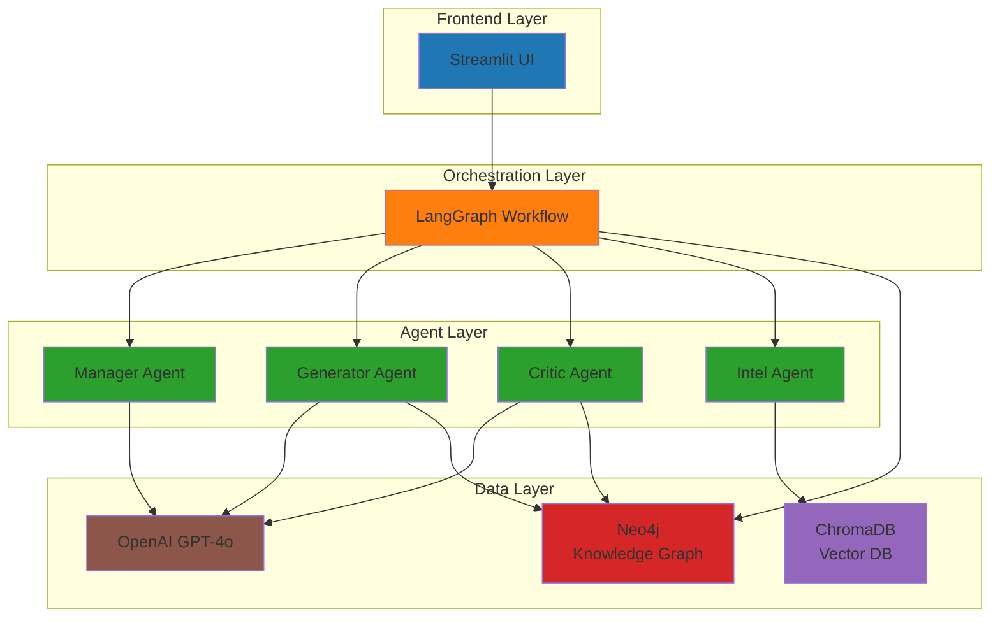

## 🔄 Workflow-Architektur

### LangGraph Workflow Flow

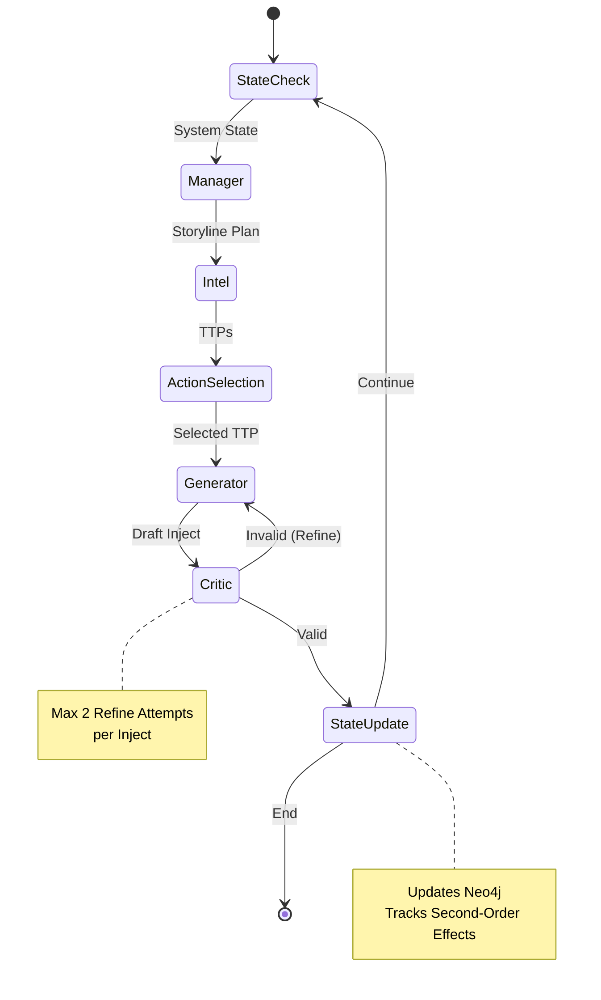

### Detaillierter Workflow

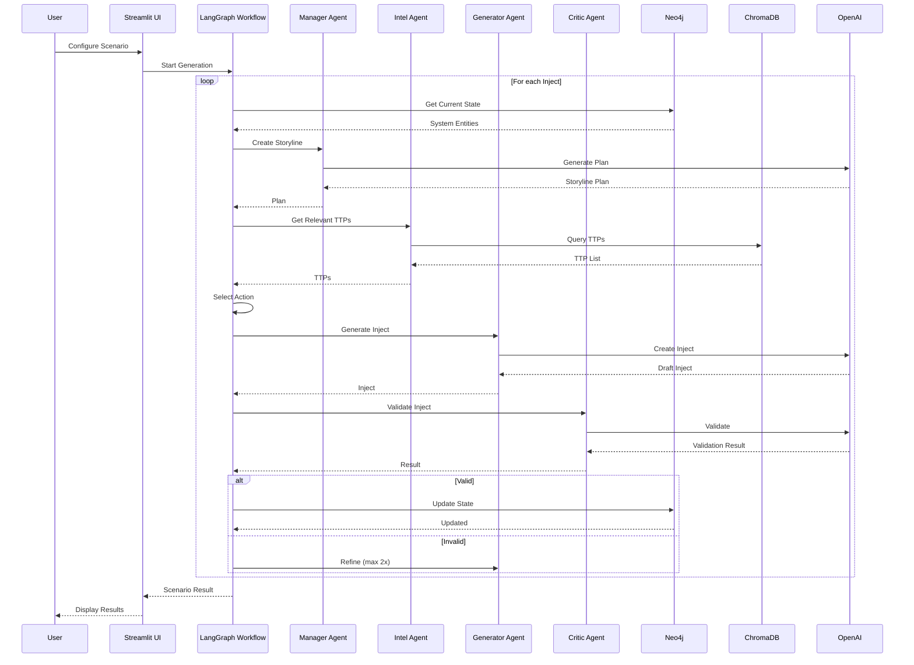

## 🧩 Komponenten-Architektur

### Agent-Architektur

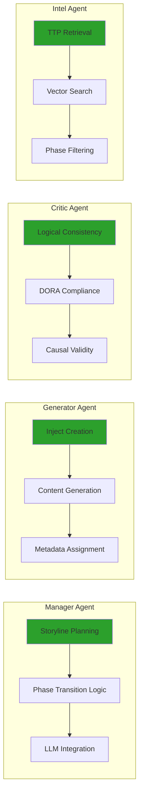

### State Management Architektur

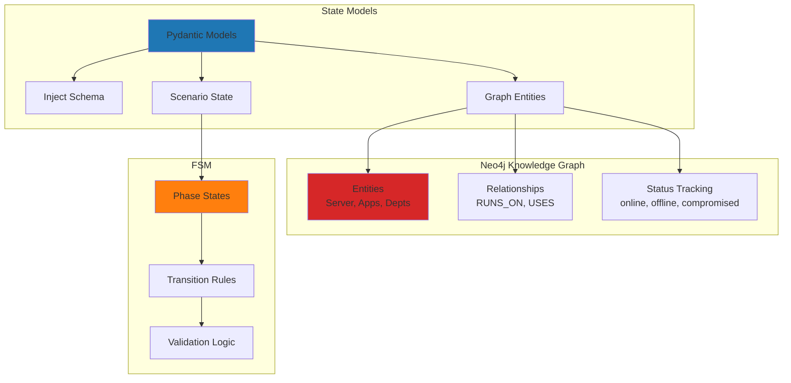

## 📦 Datenfluss

### Inject-Generierungs-Pipeline

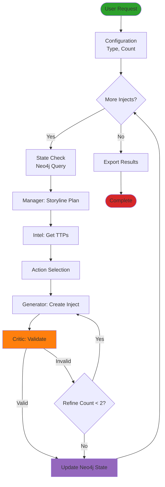

## 🔐 Sicherheits-Architektur

### Datenfluss und Sicherheit

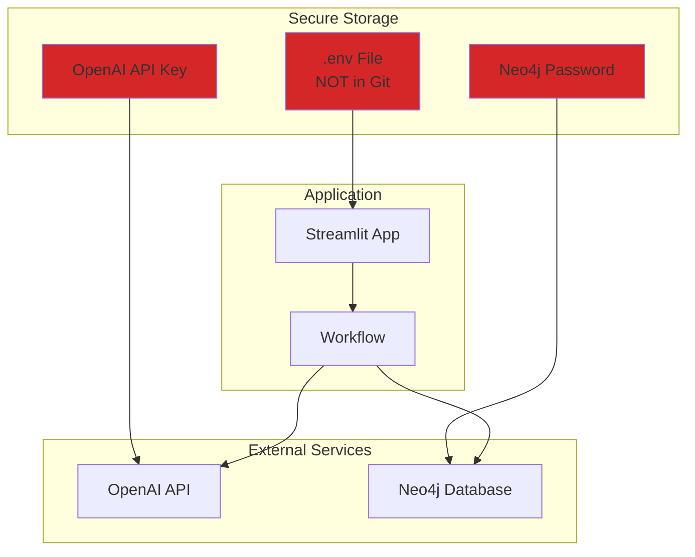

## 🗄️ Datenmodell

### Entity-Relationship Diagram

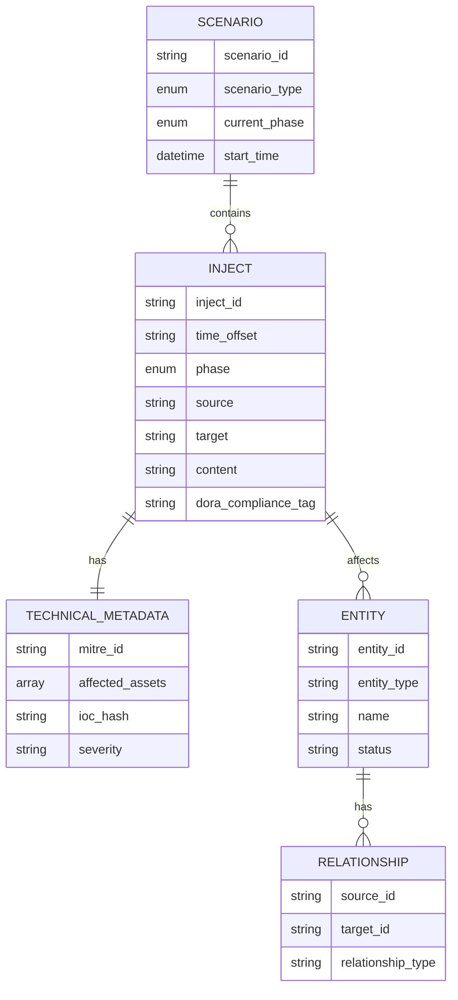

## 🔄 Phasen-Übergänge (FSM)

### Finite State Machine

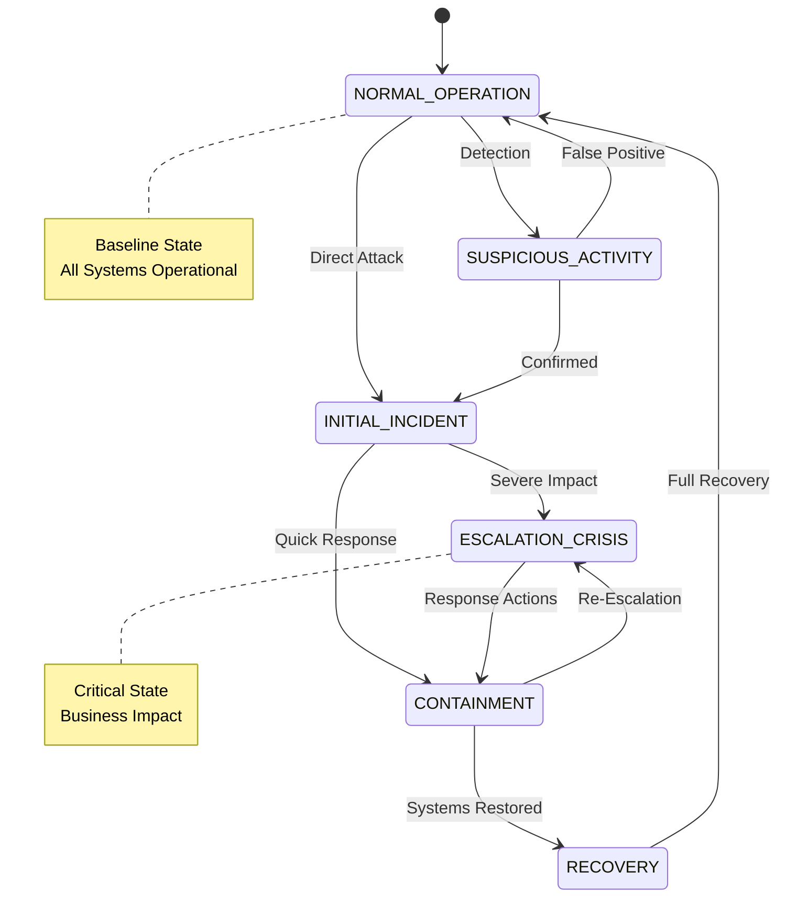

## 📊 Deployment-Architektur

### Lokale Entwicklung

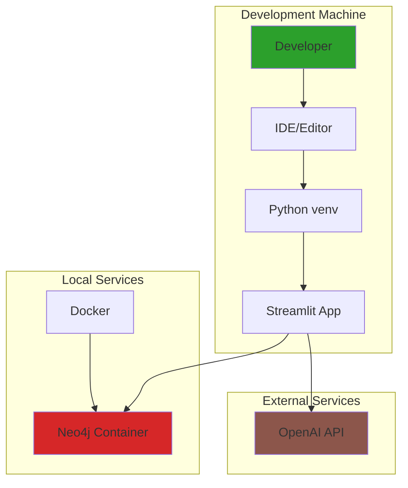

## 🔧 Technologie-Stack

### Technologie-Layers

```
┌─────────────────────────────────────────┐
│         Frontend Layer                  │
│  ┌───────────────────────────────────┐ │
│  │      Streamlit UI                 │ │
│  │  - Parameter Input                │ │
│  │  - Visualization                  │ │
│  │  - Export Functions               │ │
│  └───────────────────────────────────┘ │
└─────────────────────────────────────────┘
                    │
                    ▼
┌─────────────────────────────────────────┐
│      Orchestration Layer                │
│  ┌───────────────────────────────────┐ │
│  │      LangGraph Workflow            │ │
│  │  - State Management                │ │
│  │  - Node Orchestration              │ │
│  │  - Conditional Edges              │ │
│  └───────────────────────────────────┘ │
└─────────────────────────────────────────┘
                    │
        ┌───────────┼───────────┐
        ▼           ▼           ▼
┌───────────┐ ┌───────────┐ ┌───────────┐
│  Manager  │ │ Generator │ │  Critic   │
│   Agent   │ │   Agent   │ │   Agent   │
└───────────┘ └───────────┘ └───────────┘
        │           │           │
        └───────────┼───────────┘
                    ▼
┌─────────────────────────────────────────┐
│         Data Layer                      │
│  ┌──────────┐ ┌──────────┐ ┌──────────┐│
│  │  Neo4j   │ │ ChromaDB │ │  OpenAI  ││
│  │  Graph   │ │  Vector  │ │   API    ││
│  └──────────┘ └──────────┘ └──────────┘│
└─────────────────────────────────────────┘
```

## 📈 Skalierungs-Architektur

### Zukünftige Erweiterungen

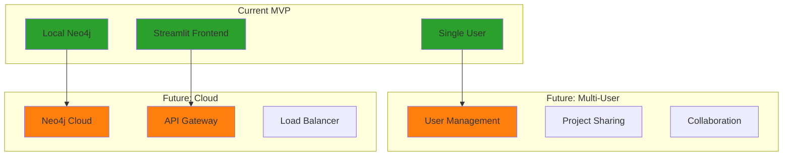

## 📝 Legende

### Farb-Codierung

- 🔵 **Blau**: Frontend/UI Komponenten
- 🟠 **Orange**: Orchestration/Workflow
- 🟢 **Grün**: Agenten
- 🔴 **Rot**: Datenbanken/Storage
- 🟣 **Lila**: Externe Services
- 🟤 **Braun**: LLM/API Services

### Diagramm-Typen

- **Mermaid**: Wird von GitHub und vielen Markdown-Viewern unterstützt
- **ASCII**: Fallback für einfache Text-Editoren
- **Flowcharts**: Für Prozess-Flows
- **State Diagrams**: Für FSM und Zustandsübergänge
- **Sequence Diagrams**: Für Interaktionen zwischen Komponenten

## 🔗 Verwandte Dokumentation

- [README.md](README.md) - Hauptdokumentation
- [STATUS.md](STATUS.md) - Feature-Status
- [SETUP.md](SETUP.md) - Setup-Anleitung

