# DORA-konformer Szenariengenerator
## Vollständige Dokumentation

**Version:** MVP 1.0  
**Datum:** 2025-01-XX  
**Projekt:** DORA-konformer Szenariengenerator für Krisenmanagement

---

**Inhaltsverzeichnis:**

1. [Projektübersicht](#projektübersicht)
2. [Status & Capabilities](#status--capabilities)
3. [Schnellstart](#schnellstart)
4. [Setup-Anleitung](#setup-anleitung)
5. [Frontend-Anleitung](#frontend-anleitung)
6. [Architektur](#architektur)
7. [Dokumentations-Übersicht](#dokumentations-übersicht)

---


\newpage

# Readme


Ein Prototyp zur Generierung realistischer, logisch konsistenter Krisenszenarien (MSELs) für Finanzunternehmen, die den Anforderungen des **Digital Operational Resilience Act (DORA)** entsprechen.

## 🎯 Projektziel

Das System verwendet **Generative KI (LLMs)**, **Multi-Agenten-Systeme** und **Knowledge Graphs**, um:
- Realistische Krisenszenarien zu generieren
- Logische Konsistenz sicherzustellen
- DORA-Konformität zu validieren
- Second-Order Effects zu modellieren

## 🏗️ Architektur

### High-Level Übersicht

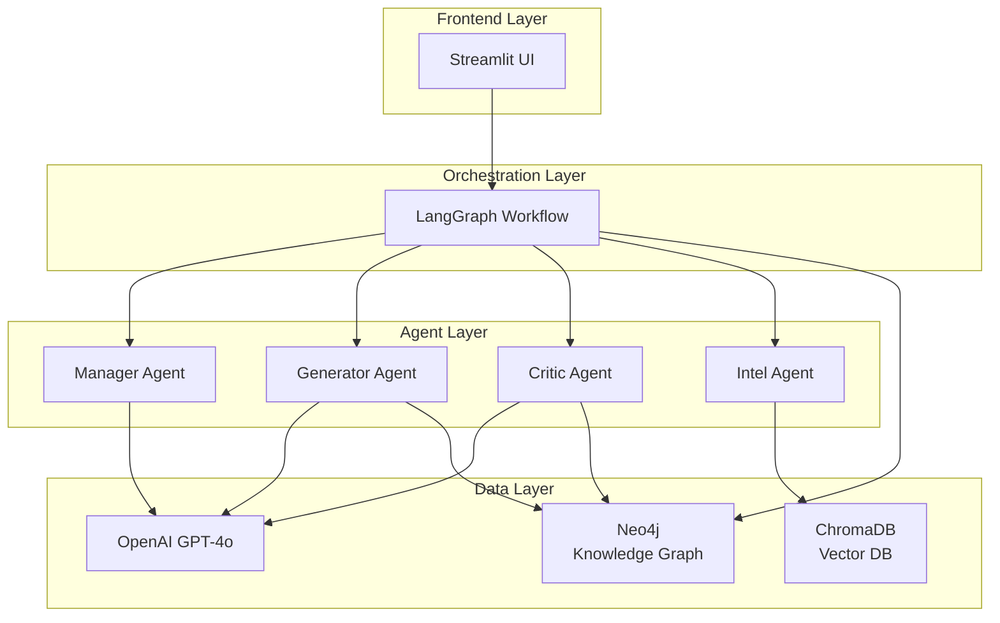

**📊 Detaillierte Architektur-Diagramme**: Siehe [ARCHITECTURE.md](ARCHITECTURE.md)

### Tech Stack

- **Sprache:** Python 3.10+
- **Frontend:** Streamlit
- **Orchestrierung:** LangGraph (Multi-Agenten-System)
- **LLM:** OpenAI GPT-4o oder Llama 3
- **Knowledge Graph:** Neo4j
- **Vektor-Datenbank:** ChromaDB (für RAG)
- **Validierung:** Pydantic

### Komponenten

1. **State Models** (`state_models.py`): Pydantic-Modelle für Injects, State Management, Knowledge Graph Entitäten
2. **Neo4j Client** (`neo4j_client.py`): Verwaltung des Knowledge Graph States
3. **LangGraph Workflow**: Orchestrierung der Agenten (Manager, Generator, Critic, Intel)
4. **Streamlit Frontend**: Parametereingabe und Visualisierung

## 🚀 Setup

### 1. Installation

```bash
# Virtual Environment erstellen
python -m venv venv
source venv/bin/activate  # Auf Windows: venv\Scripts\activate

# Dependencies installieren
pip install -r requirements.txt
```

### 2. Umgebungsvariablen

Kopiere `.env.example` zu `.env` und fülle die Werte aus:

```bash
cp .env.example .env
```

Bearbeite `.env`:
- `NEO4J_URI`: Neo4j Verbindungs-URI (Standard: `bolt://localhost:7687`)
- `NEO4J_USER`: Neo4j Benutzername
- `NEO4J_PASSWORD`: Neo4j Passwort
- `OPENAI_API_KEY`: OpenAI API Key

### 3. Neo4j Setup

Stelle sicher, dass Neo4j läuft:

```bash
# Mit Docker
docker run -d \
  --name neo4j \
  -p 7474:7474 -p 7687:7687 \
  -e NEO4J_AUTH=neo4j/password \
  neo4j:latest
```

### 4. Neo4j starten

```bash
# Mit dem bereitgestellten Skript
./start_neo4j.sh

# Oder manuell mit Docker
docker run -d \
  --name neo4j \
  -p 7474:7474 -p 7687:7687 \
  -e NEO4J_AUTH=neo4j/password \
  neo4j:latest
```

### 5. Setup testen

```bash
# Prüfe ob alles funktioniert
python check_setup.py

# Teste den Workflow
python test_workflow.py
```

## 📋 Verwendung

### Frontend (Empfohlen)

Die einfachste Art, das System zu nutzen, ist über das Streamlit Frontend:

1. Starte die App: `streamlit run app.py`
2. Wähle Szenario-Typ und Anzahl Injects
3. Klicke auf "Szenario generieren"
4. Prüfe Ergebnisse im "Ergebnisse" Tab
5. Exportiere bei Bedarf (CSV/JSON)

Siehe [FRONTEND.md](FRONTEND.md) für detaillierte Anleitung.

### Programmgesteuerte Nutzung

#### State Models

Die Pydantic-Modelle in `state_models.py` definieren:

- **`Inject`**: MSEL-Inject Schema mit Validierung
- **`ScenarioState`**: Zustand eines laufenden Szenarios
- **`KnowledgeGraphEntity`**: Entität für den Neo4j Graph
- **`ValidationResult`**: Ergebnis der Critic-Agent Validierung

#### Neo4j Client

Der `Neo4jClient` verwaltet den Systemzustand:

```python
from neo4j_client import Neo4jClient

with Neo4jClient() as client:
    # Aktuellen State abfragen
    entities = client.get_current_state()
    
    # Status einer Entität aktualisieren
    client.update_entity_status("SRV-001", "offline", inject_id="INJ-005")
    
    # Second-Order Effects abfragen
    affected = client.get_affected_entities("SRV-001")
```

#### Workflow

```python
from workflows.scenario_workflow import ScenarioWorkflow
from state_models import ScenarioType

workflow = ScenarioWorkflow(neo4j_client=neo4j, max_iterations=10)
result = workflow.generate_scenario(ScenarioType.RANSOMWARE_DOUBLE_EXTORTION)
```

## 🔄 Workflow (implementiert)

Der LangGraph-basierte Workflow orchestriert folgende Schritte:

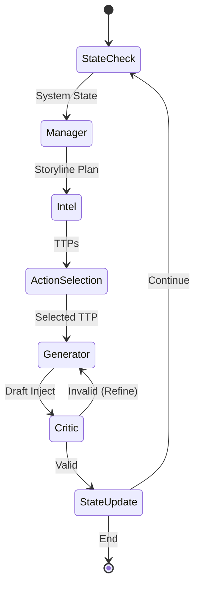

**Detaillierte Schritte:**

1. **State Check**: Abfrage des aktuellen Systemzustands aus Neo4j
2. **Manager Agent**: Erstellt Storyline-Plan basierend auf Szenario-Typ und Phase
3. **Intel Agent**: Stellt relevante MITRE ATT&CK TTPs bereit
4. **Action Selection**: Auswahl des nächsten logischen Angriffsschritts
5. **Generator Agent**: Erstellt detaillierten Inject mit LLM
6. **Critic Agent**: Validiert Logik, DORA-Konformität und Causal Validity
7. **State Update**: Schreibt Auswirkungen in Neo4j (inkl. Second-Order Effects)
8. **Refine Loop**: Bei Validierungsfehlern zurück zum Generator (max. 2 Versuche)

**📊 Vollständige Workflow-Diagramme**: Siehe [ARCHITECTURE.md](ARCHITECTURE.md)

## 📊 Szenario-Typen

- Ransomware & Double Extortion
- DDoS auf kritische Funktionen
- Supply Chain Compromise
- Insider Threat / Datenmanipulation

## 🧪 Qualitäts-Metriken

- **Logical Consistency**: Widerspruchsfreiheit zur Historie
- **Causal Validity**: MITRE ATT&CK Graph Konformität
- **DORA Compliance**: Artikel 25 Anforderungen

## 🎯 Schnellstart

### Frontend starten

```bash
# Virtual Environment aktivieren
source venv/bin/activate

# Streamlit App starten
streamlit run app.py
```

Die App öffnet sich automatisch im Browser unter `http://localhost:8501`

### Programmgesteuert verwenden

```python
from neo4j_client import Neo4jClient
from workflows.scenario_workflow import ScenarioWorkflow
from state_models import ScenarioType

# Initialisiere
neo4j = Neo4jClient()
neo4j.connect()

workflow = ScenarioWorkflow(neo4j_client=neo4j, max_iterations=10)

# Generiere Szenario
result = workflow.generate_scenario(
    scenario_type=ScenarioType.RANSOMWARE_DOUBLE_EXTORTION
)

# Verarbeite Ergebnisse
for inject in result['injects']:
    print(f"{inject.inject_id}: {inject.content}")
```

## ✅ Implementierte Features

- ✅ LangGraph Workflow mit Multi-Agenten-System
- ✅ 4 Agenten: Manager, Generator, Critic, Intel
- ✅ Neo4j Knowledge Graph für State Management
- ✅ FSM-basierte Phasen-Übergänge
- ✅ Streamlit Frontend mit Visualisierungen
- ✅ Export-Funktionalität (CSV, JSON)
- ✅ DORA-Compliance Validierung
- ✅ MITRE ATT&CK Integration
- ✅ Second-Order Effects Tracking

## 📝 Nächste Schritte / Verbesserungspotenzial

Siehe [STATUS.md](STATUS.md) für detaillierte Informationen zu:
- Was das System jetzt kann
- Was noch fehlt
- Wie es eingesetzt werden kann
- Roadmap für zukünftige Features

## 📄 Lizenz

[Zu definieren]


---


\newpage

# Status


## ✅ Was das System jetzt kann

### 🎯 Kernfunktionalität

#### 1. **Szenario-Generierung**
- ✅ Generierung realistischer Krisenszenarien für Finanzunternehmen
- ✅ Unterstützung für 4 Szenario-Typen:
  - Ransomware & Double Extortion
  - DDoS auf kritische Funktionen
  - Supply Chain Compromise
  - Insider Threat / Datenmanipulation
- ✅ Automatische Phasen-Übergänge (FSM-basiert)
- ✅ Konfigurierbare Anzahl von Injects (1-20)

#### 2. **Multi-Agenten-System (LangGraph)**
- ✅ **Manager Agent**: Erstellt Storyline-Pläne basierend auf Szenario-Typ und Systemzustand
- ✅ **Generator Agent**: Generiert detaillierte, realistische Injects mit LLM
- ✅ **Critic Agent**: Validiert Injects auf:
  - Logische Konsistenz
  - DORA-Compliance (Artikel 25)
  - Causal Validity (MITRE ATT&CK)
- ✅ **Intel Agent**: Stellt relevante TTPs (Taktiken, Techniken, Prozeduren) bereit

#### 3. **State Management**
- ✅ Neo4j Knowledge Graph für Systemzustand
- ✅ Tracking von Assets (Server, Applikationen, Abteilungen)
- ✅ Second-Order Effects (indirekte Auswirkungen)
- ✅ Status-Updates basierend auf Injects

#### 4. **Validierung & Qualitätssicherung**
- ✅ Pydantic-basierte Schema-Validierung
- ✅ FSM-Validierung für Phasen-Übergänge
- ✅ LLM-basierte Konsistenz-Prüfung
- ✅ Refine-Loop bei Validierungsfehlern (max. 2 Versuche)

#### 5. **Frontend (Streamlit)**
- ✅ Benutzerfreundliche Web-UI
- ✅ Parametereingabe (Szenario-Typ, Anzahl Injects)
- ✅ Detaillierte Inject-Anzeige
- ✅ Visualisierungen (Phasen-Verteilung, Timeline)
- ✅ Export-Funktionen (CSV, JSON)

#### 6. **Datenmodell**
- ✅ Vollständiges Inject-Schema (Pydantic)
- ✅ Technical Metadata (MITRE IDs, IOCs, Assets)
- ✅ DORA Compliance Tags
- ✅ Business Impact Tracking

### 🔧 Technische Features

- ✅ LangGraph Workflow-Orchestrierung
- ✅ OpenAI GPT-4o Integration
- ✅ Neo4j Knowledge Graph
- ✅ ChromaDB für TTP-Vektor-Datenbank (Grundstruktur)
- ✅ Automatische Fehlerbehandlung
- ✅ Session Management (Streamlit)

---

## ⚠️ Was noch fehlt / Verbesserungspotenzial

### 🔴 Kritische Features (für Produktion)

1. **ChromaDB TTP-Datenbank**
   - ❌ Vollständige MITRE ATT&CK TTP-Datenbank noch nicht geladen
   - ⚠️ Aktuell: Fallback-TTPs werden verwendet
   - 📝 **Nächster Schritt**: MITRE ATT&CK Daten importieren

2. **Erweiterte Validierung**
   - ❌ NLI-Modelle für tiefere Konsistenz-Prüfung
   - ❌ Automatische Widerspruchserkennung zwischen Injects
   - 📝 **Nächster Schritt**: NLI-Modell Integration

3. **Fehlerbehandlung**
   - ⚠️ Teilweise: Bessere Fehlerbehandlung bei LLM-Aufrufen
   - ⚠️ Retry-Logik für API-Calls
   - 📝 **Nächster Schritt**: Robustere Error Handling

### 🟡 Wichtige Features (für erweiterte Nutzung)

4. **TIBER-EU Konformität**
   - ❌ "Flags" (Ziele) Generierung
   - ❌ "Leg-ups" (Hilfestellungen) Generierung
   - 📝 **Nächster Schritt**: TIBER-spezifische Features

5. **Komplexitäts-Parameter**
   - ⚠️ Teilweise: Proportionalitätsprinzip noch nicht vollständig implementiert
   - ❌ Parametrisierung für verschiedene Unternehmensgrößen
   - 📝 **Nächster Schritt**: Komplexitäts-Slider im Frontend

6. **Export-Formate**
   - ✅ CSV, JSON
   - ❌ Excel (.xlsx)
   - ❌ MSEL-Format (Standard für Übungen)
   - 📝 **Nächster Schritt**: Excel & MSEL Export

7. **Historische Szenarien**
   - ❌ Speicherung von generierten Szenarien
   - ❌ Vergleich zwischen Szenarien
   - ❌ Wiederverwendung von erfolgreichen Szenarien
   - 📝 **Nächster Schritt**: Datenbank für Szenarien

### 🟢 Nice-to-Have Features

8. **Erweiterte Visualisierungen**
   - ⚠️ Basis: Phasen-Verteilung, Timeline
   - ❌ Interaktive Graphen (Neo4j Visualisierung)
   - ❌ Attack-Kill-Chain Visualisierung
   - 📝 **Nächster Schritt**: Graph-Visualisierung

9. **Templates & Vorlagen**
   - ❌ Vordefinierte Szenario-Templates
   - ❌ Wiederverwendbare Inject-Patterns
   - 📝 **Nächster Schritt**: Template-System

10. **Multi-User Support**
    - ❌ Benutzer-Authentifizierung
    - ❌ Projekt-Management
    - ❌ Kollaboration
    - 📝 **Nächster Schritt**: User Management

11. **API-Endpoints**
    - ❌ REST API für externe Integration
    - ❌ Webhook-Support
    - 📝 **Nächster Schritt**: FastAPI Integration

12. **Testing & Qualitätssicherung**
    - ⚠️ Teilweise: Basis-Tests vorhanden
    - ❌ Unit Tests für alle Agenten
    - ❌ Integration Tests
    - ❌ End-to-End Tests
    - 📝 **Nächster Schritt**: Test-Suite erweitern

---

## 🚀 Wie das System eingesetzt werden kann

### 📋 Aktuelle Anwendungsfälle

#### 1. **Krisenübungen vorbereiten**
```
Zweck: Realistische MSELs (Master Scenario Event Lists) für Übungen generieren

Workflow:
1. Frontend öffnen (streamlit run app.py)
2. Szenario-Typ wählen (z.B. Ransomware)
3. Anzahl Injects konfigurieren (z.B. 10)
4. Szenario generieren
5. Injects prüfen und anpassen
6. Als CSV/JSON exportieren
7. In Übungs-Tool importieren
```

#### 2. **DORA-Compliance prüfen**
```
Zweck: Prüfen ob Szenarien DORA Artikel 25 Anforderungen erfüllen

Workflow:
1. Szenario generieren
2. DORA Tags in Ergebnissen prüfen
3. Validierungsdetails anzeigen
4. Bei Bedarf anpassen und neu generieren
```

#### 3. **Threat-Led Penetration Testing (TLPT)**
```
Zweck: Szenarien für TIBER-EU konforme Tests erstellen

Workflow:
1. Szenario generieren
2. MITRE ATT&CK TTPs analysieren
3. Attack-Kill-Chain nachvollziehen
4. Für Red Team Übungen verwenden
```

#### 4. **Business Continuity Planung**
```
Zweck: Geschäftliche Auswirkungen von Cyber-Angriffen simulieren

Workflow:
1. Szenario mit Business Impact generieren
2. Betroffene Assets analysieren
3. Second-Order Effects prüfen
4. Business Continuity Pläne anpassen
```

### 🔧 Technische Integration

#### **Als Standalone-Tool**
```bash
# Direkte Nutzung über Streamlit
streamlit run app.py
```

#### **Als Python-Modul**
```python
from neo4j_client import Neo4jClient
from workflows.scenario_workflow import ScenarioWorkflow
from state_models import ScenarioType

# Initialisiere
neo4j = Neo4jClient()
neo4j.connect()

workflow = ScenarioWorkflow(neo4j_client=neo4j, max_iterations=10)

# Generiere Szenario
result = workflow.generate_scenario(
    scenario_type=ScenarioType.RANSOMWARE_DOUBLE_EXTORTION
)

# Verarbeite Ergebnisse
for inject in result['injects']:
    print(f"{inject.inject_id}: {inject.content}")
```

#### **Export & Weiterverarbeitung**
```python
# CSV Export
import pandas as pd
from app import export_to_csv

csv_data = export_to_csv(result['injects'])
# Weiterverarbeitung in Excel, etc.

# JSON Export
from app import export_to_json
json_data = export_to_json(result['injects'])
# API-Integration, etc.
```

### 📊 Empfohlene Workflows

#### **Schneller Test (3-5 Injects)**
- Für erste Tests und Konzept-Validierung
- Dauer: ~2-5 Minuten
- Ideal für: Schnelle Prototypen

#### **Standard-Szenario (10-15 Injects)**
- Für vollständige Übungen
- Dauer: ~10-15 Minuten
- Ideal für: Reguläre Krisenübungen

#### **Komplexes Szenario (15-20 Injects)**
- Für umfassende Tests
- Dauer: ~20-30 Minuten
- Ideal für: Große Übungen, Audits

### ⚙️ Konfiguration

#### **Umgebungsvariablen (.env)**
```env
# Neo4j
NEO4J_URI=bolt://localhost:7687
NEO4J_USER=neo4j
NEO4J_PASSWORD=your_password

# OpenAI
OPENAI_API_KEY=your_api_key

# ChromaDB (optional)
CHROMA_DB_PATH=./chroma_db
```

#### **Workflow-Parameter**
- `max_iterations`: Anzahl Injects (1-20)
- `scenario_type`: Szenario-Typ
- `auto_phase_transition`: Automatische Phasen-Übergänge

---

## 📈 Roadmap

### **Phase 1: MVP (✅ Abgeschlossen)**
- ✅ Grundstruktur
- ✅ Agenten-Implementierung
- ✅ Frontend
- ✅ Basis-Validierung

### **Phase 2: Erweiterte Features (🔄 In Arbeit)**
- 🔄 ChromaDB TTP-Datenbank
- 🔄 Erweiterte Validierung
- 🔄 Excel Export
- 🔄 TIBER-EU Features

### **Phase 3: Produktionsreife (📅 Geplant)**
- 📅 Vollständige Test-Suite
- 📅 API-Endpoints
- 📅 Multi-User Support
- 📅 Performance-Optimierung

---

## 🎓 Best Practices

1. **Erste Nutzung**: Starte mit 3-5 Injects zum Testen
2. **Neo4j**: Stelle sicher, dass Neo4j läuft vor der Generierung
3. **Validierung**: Prüfe Validierungswarnungen in den Ergebnissen
4. **Export**: Exportiere regelmäßig für Backup
5. **Anpassungen**: Passe Injects manuell an, wenn nötig

---

## 📞 Support & Weiterentwicklung

- **Dokumentation**: Siehe README.md, SETUP.md, FRONTEND.md
- **Tests**: `python test_workflow.py`
- **Setup-Prüfung**: `python check_setup.py`

---

**Letzte Aktualisierung**: 2025-01-XX
**Version**: MVP 1.0


---


\newpage

# Quickstart


Schnellstart-Anleitung für den DORA-Szenariengenerator.

## ⚡ In 5 Minuten zum ersten Szenario

### Schritt 1: Voraussetzungen prüfen

```bash
# Python 3.10+ installiert?
python3 --version

# Docker installiert? (für Neo4j)
docker --version
```

### Schritt 2: Projekt einrichten

```bash
# Repository klonen/öffnen
cd BA

# Virtual Environment erstellen
python3 -m venv venv
source venv/bin/activate  # Windows: venv\Scripts\activate

# Dependencies installieren
pip install -r requirements.txt
```

### Schritt 3: Konfiguration

```bash
# .env Datei erstellen
cp .env.example .env

# .env bearbeiten und eintragen:
# - NEO4J_PASSWORD=dein_passwort
# - OPENAI_API_KEY=dein_api_key
```

### Schritt 4: Neo4j starten

```bash
# Docker starten (falls nicht läuft)
# Dann Neo4j Container starten
./start_neo4j.sh
```

### Schritt 5: Setup testen

```bash
# Prüfe ob alles funktioniert
python check_setup.py
```

### Schritt 6: Frontend starten

```bash
streamlit run app.py
```

### Schritt 7: Erstes Szenario generieren

1. Öffne Browser: `http://localhost:8501`
2. Wähle Szenario-Typ (z.B. "Ransomware Double Extortion")
3. Setze Anzahl Injects auf 3 (für schnellen Test)
4. Klicke auf "🎯 Szenario generieren"
5. Warte ~2-5 Minuten
6. Prüfe Ergebnisse im "Ergebnisse" Tab

## 📚 Weitere Dokumentation

- **README.md**: Vollständige Projekt-Dokumentation
- **STATUS.md**: Was kann das System, was fehlt, wie einsetzen
- **SETUP.md**: Detaillierte Setup-Anleitung
- **FRONTEND.md**: Frontend-Bedienungsanleitung

## 🆘 Häufige Probleme

### Neo4j-Verbindungsfehler
```bash
# Prüfe ob Neo4j läuft
docker ps | grep neo4j

# Starte Neo4j falls nicht
./start_neo4j.sh
```

### OpenAI API Fehler
- Prüfe `.env` Datei
- Stelle sicher, dass `OPENAI_API_KEY` gesetzt ist
- Prüfe API Key Gültigkeit

### Import-Fehler
```bash
# Stelle sicher, dass venv aktiviert ist
source venv/bin/activate

# Reinstalliere Dependencies
pip install -r requirements.txt
```

## ✅ Erfolg!

Wenn du dein erstes Szenario generiert hast, kannst du:
- Injects im Frontend ansehen
- Als CSV/JSON exportieren
- Visualisierungen prüfen
- Mit verschiedenen Szenario-Typen experimentieren

Viel Erfolg! 🎯


---


\newpage

# Setup


## Schritt 1: Python Virtual Environment erstellen

```bash
# Virtual Environment erstellen
python3 -m venv venv

# Aktivieren (macOS/Linux)
source venv/bin/activate

# Aktivieren (Windows)
venv\Scripts\activate
```

## Schritt 2: Dependencies installieren

```bash
pip install -r requirements.txt
```

## Schritt 3: Umgebungsvariablen konfigurieren

```bash
# .env Datei erstellen
cp .env.example .env
```

Dann öffne `.env` und trage deine Werte ein:

```env
# Neo4j (optional für jetzt - kann später konfiguriert werden)
NEO4J_URI=bolt://localhost:7687
NEO4J_USER=neo4j
NEO4J_PASSWORD=dein_passwort_hier

# OpenAI (wird später für LLM benötigt)
OPENAI_API_KEY=dein_api_key_hier
```

## Schritt 4: Setup testen

```bash
python test_setup.py
```

Dieser Test prüft:
- ✅ Pydantic-Modelle funktionieren
- ✅ Neo4j-Verbindung (falls konfiguriert)

## Schritt 5: Neo4j starten (optional)

Falls du Neo4j testen möchtest:

```bash
# Mit Docker
docker run -d \
  --name neo4j \
  -p 7474:7474 -p 7687:7687 \
  -e NEO4J_AUTH=neo4j/password \
  neo4j:latest
```

Dann in `.env` eintragen:
```
NEO4J_PASSWORD=password
```

## ✅ Fertig!

Wenn `test_setup.py` erfolgreich durchläuft, ist die Grundstruktur bereit.

## Nächste Entwicklungsschritte

1. **LangGraph Workflow** implementieren
2. **Agenten** entwickeln (Manager, Generator, Critic, Intel)
3. **ChromaDB** für RAG einrichten
4. **Streamlit Frontend** erstellen


---


\newpage

# Frontend


## 🚀 Starten

```bash
# Virtual Environment aktivieren
source venv/bin/activate

# Streamlit App starten
streamlit run app.py
```

Die App öffnet sich automatisch im Browser unter `http://localhost:8501`

## 📋 Features

### 1. **Generierung Tab**
- Szenario-Typ auswählen (Ransomware, DDoS, Supply Chain, Insider Threat)
- Anzahl Injects konfigurieren (1-20)
- Erweiterte Optionen:
  - Automatische Phasen-Übergänge
  - Validierungsdetails anzeigen

### 2. **Ergebnisse Tab**
- Übersicht aller generierten Injects
- Detaillierte Anzeige pro Inject:
  - Inject ID & Zeitversatz
  - Phase (mit farblicher Markierung)
  - Quelle & Ziel
  - Modalität
  - Inhalt
  - MITRE ID
  - Betroffene Assets
  - DORA Compliance Tag
  - Business Impact
- Export-Funktionen:
  - CSV Export
  - JSON Export

### 3. **Visualisierung Tab**
- Phasen-Verteilung (Balkendiagramm)
- Timeline-Übersicht
- Betroffene Assets-Liste

## 🎯 Verwendung

1. **Konfiguration** (Sidebar):
   - Wähle Szenario-Typ
   - Setze Anzahl Injects
   - Aktiviere/deaktiviere erweiterte Optionen

2. **Generierung**:
   - Klicke auf "🎯 Szenario generieren"
   - Warte auf Abschluss (kann einige Minuten dauern)
   - Erfolgsmeldung erscheint

3. **Ergebnisse ansehen**:
   - Wechsle zum "📊 Ergebnisse" Tab
   - Scrolle durch alle Injects
   - Exportiere bei Bedarf

4. **Visualisierung**:
   - Wechsle zum "📈 Visualisierung" Tab
   - Analysiere Phasen-Verteilung und Timeline

## ⚠️ Wichtige Hinweise

- **Neo4j muss laufen**: Stelle sicher, dass Neo4j läuft (`./start_neo4j.sh`)
- **OpenAI API Key**: Muss in `.env` konfiguriert sein
- **Erste Generierung**: Kann länger dauern (LLM-Aufrufe)
- **Session State**: Ergebnisse bleiben während der Session erhalten

## 🔧 Troubleshooting

### App startet nicht
```bash
# Prüfe ob Streamlit installiert ist
pip install streamlit

# Prüfe Python-Version
python --version  # Sollte 3.10+ sein
```

### Neo4j-Verbindungsfehler
```bash
# Starte Neo4j
./start_neo4j.sh

# Prüfe Verbindung
python check_setup.py
```

### OpenAI API Fehler
- Prüfe `.env` Datei
- Stelle sicher, dass `OPENAI_API_KEY` gesetzt ist
- Prüfe API Key Gültigkeit


---


\newpage

# Architecture


Detaillierte Architektur-Diagramme und Beschreibungen des DORA-Szenariengenerators.

## 📊 Übersicht

### High-Level Architektur

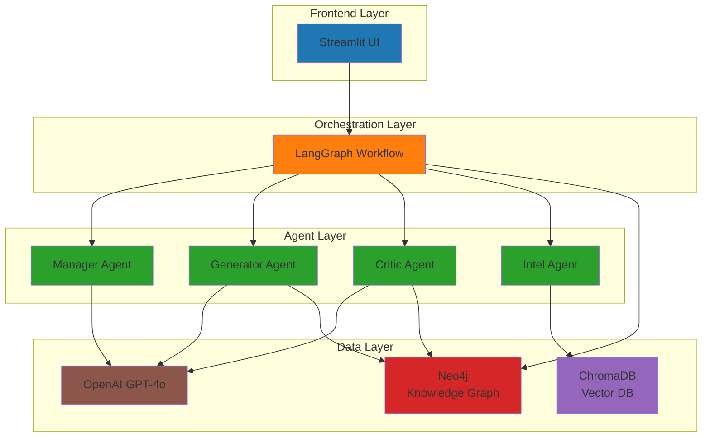

## 🔄 Workflow-Architektur

### LangGraph Workflow Flow

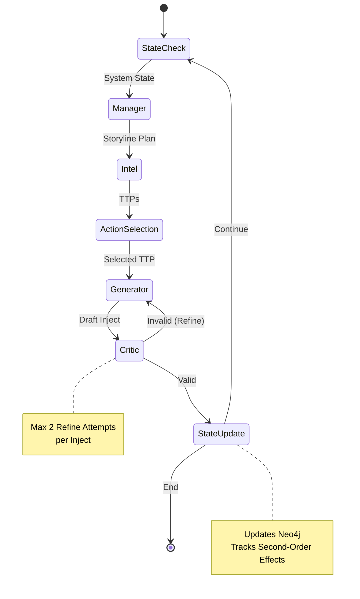

### Detaillierter Workflow

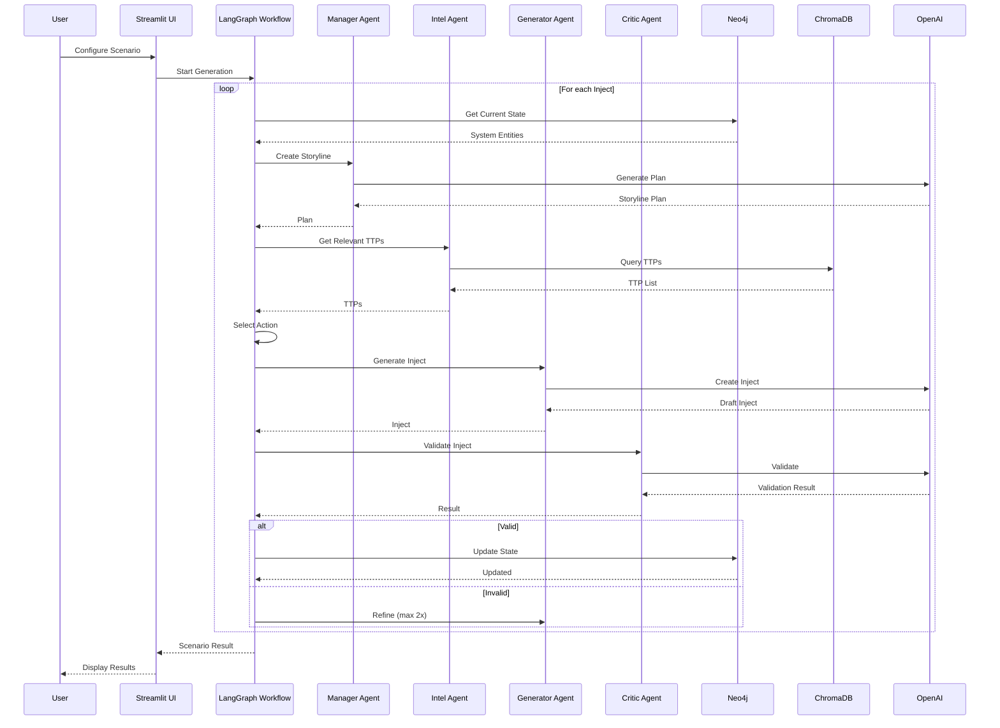

## 🧩 Komponenten-Architektur

### Agent-Architektur

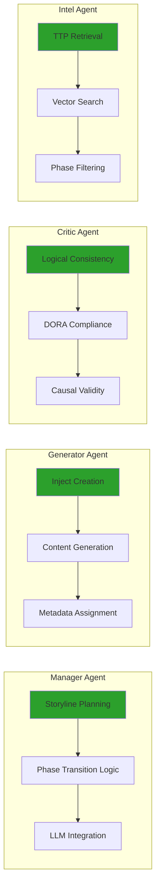

### State Management Architektur

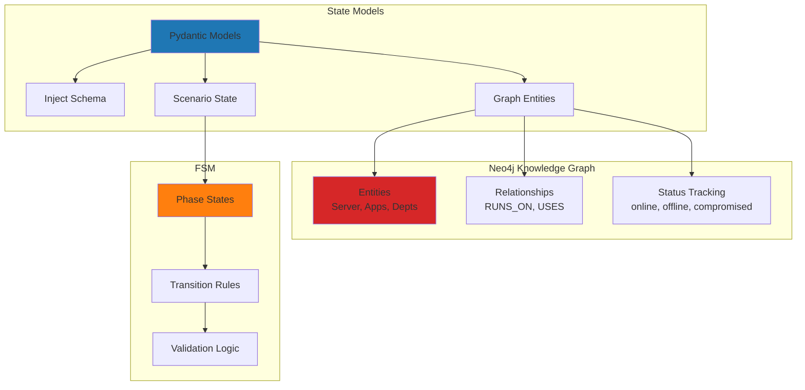

## 📦 Datenfluss

### Inject-Generierungs-Pipeline

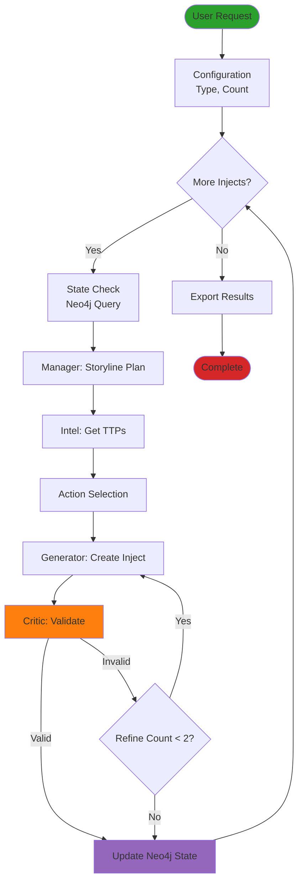

## 🔐 Sicherheits-Architektur

### Datenfluss und Sicherheit

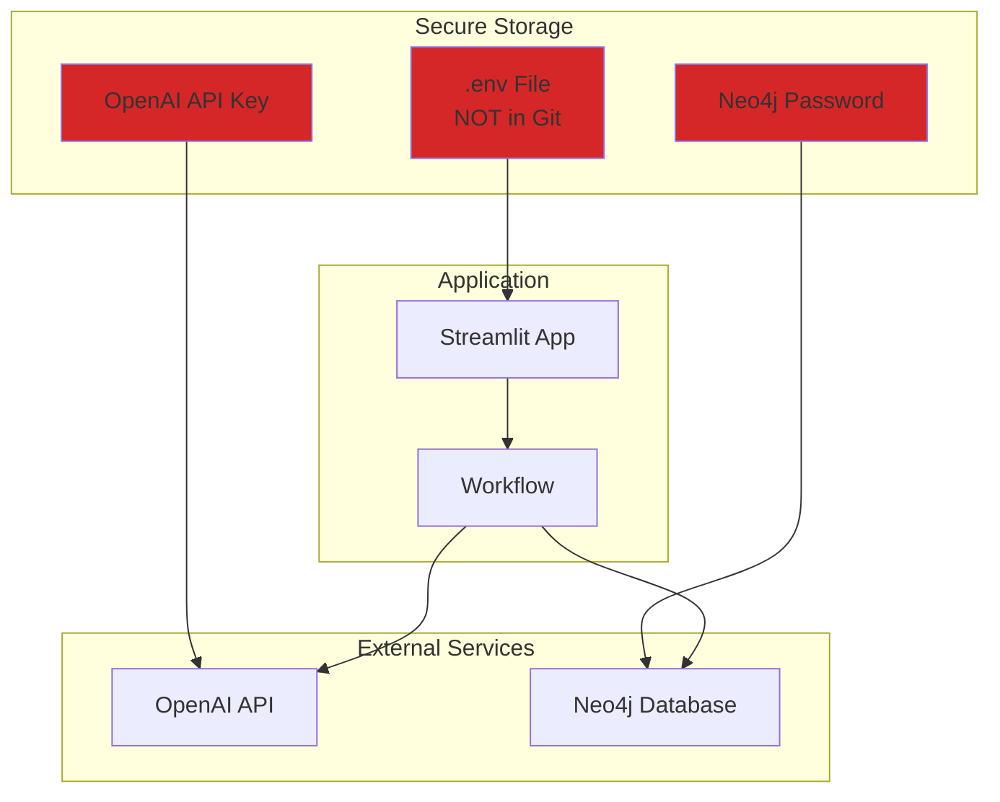

## 🗄️ Datenmodell

### Entity-Relationship Diagram

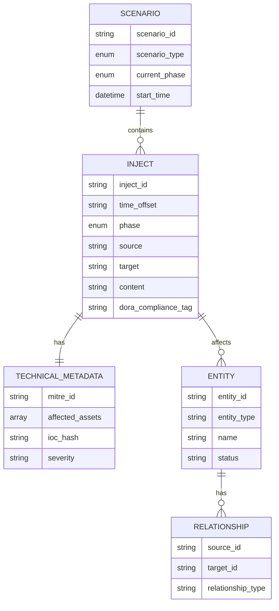

## 🔄 Phasen-Übergänge (FSM)

### Finite State Machine

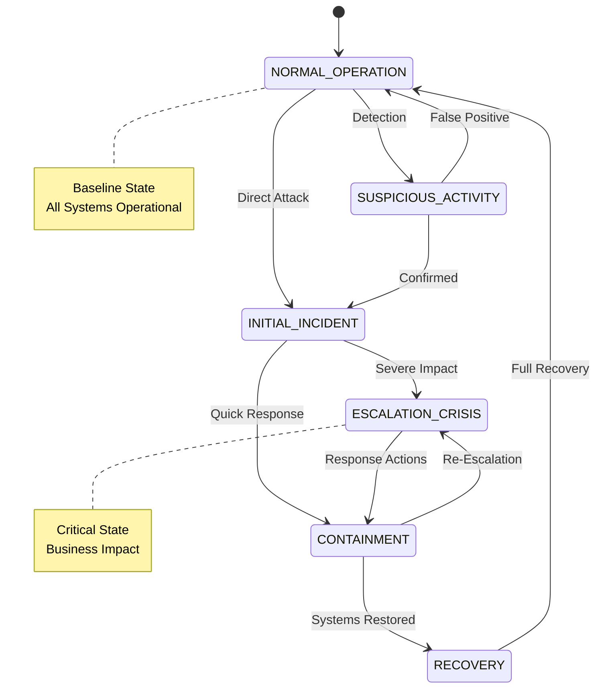

## 📊 Deployment-Architektur

### Lokale Entwicklung

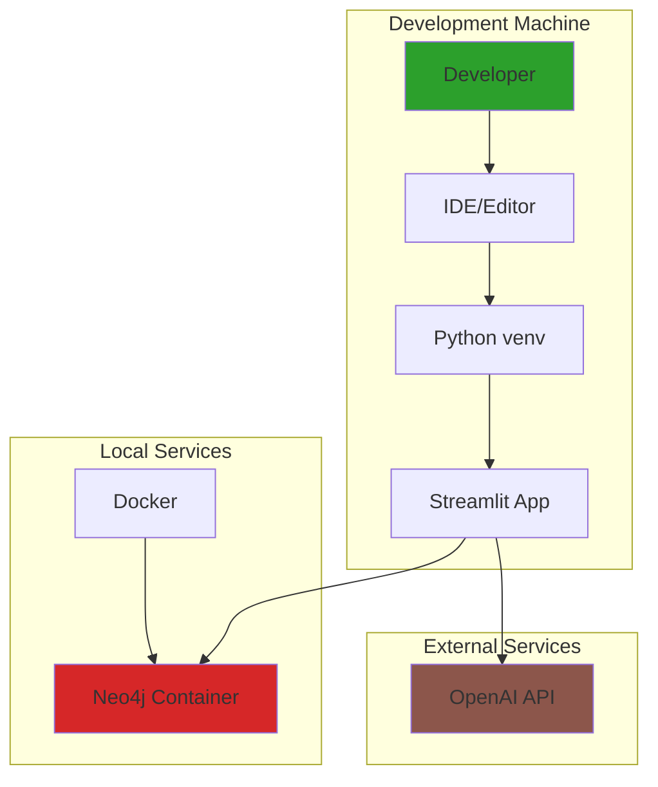

## 🔧 Technologie-Stack

### Technologie-Layers

```
┌─────────────────────────────────────────┐
│         Frontend Layer                  │
│  ┌───────────────────────────────────┐ │
│  │      Streamlit UI                 │ │
│  │  - Parameter Input                │ │
│  │  - Visualization                  │ │
│  │  - Export Functions               │ │
│  └───────────────────────────────────┘ │
└─────────────────────────────────────────┘
                    │
                    ▼
┌─────────────────────────────────────────┐
│      Orchestration Layer                │
│  ┌───────────────────────────────────┐ │
│  │      LangGraph Workflow            │ │
│  │  - State Management                │ │
│  │  - Node Orchestration              │ │
│  │  - Conditional Edges              │ │
│  └───────────────────────────────────┘ │
└─────────────────────────────────────────┘
                    │
        ┌───────────┼───────────┐
        ▼           ▼           ▼
┌───────────┐ ┌───────────┐ ┌───────────┐
│  Manager  │ │ Generator │ │  Critic   │
│   Agent   │ │   Agent   │ │   Agent   │
└───────────┘ └───────────┘ └───────────┘
        │           │           │
        └───────────┼───────────┘
                    ▼
┌─────────────────────────────────────────┐
│         Data Layer                      │
│  ┌──────────┐ ┌──────────┐ ┌──────────┐│
│  │  Neo4j   │ │ ChromaDB │ │  OpenAI  ││
│  │  Graph   │ │  Vector  │ │   API    ││
│  └──────────┘ └──────────┘ └──────────┘│
└─────────────────────────────────────────┘
```

## 📈 Skalierungs-Architektur

### Zukünftige Erweiterungen

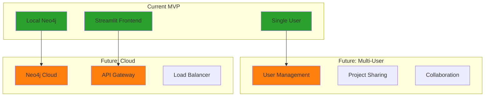

## 📝 Legende

### Farb-Codierung

- 🔵 **Blau**: Frontend/UI Komponenten
- 🟠 **Orange**: Orchestration/Workflow
- 🟢 **Grün**: Agenten
- 🔴 **Rot**: Datenbanken/Storage
- 🟣 **Lila**: Externe Services
- 🟤 **Braun**: LLM/API Services

### Diagramm-Typen

- **Mermaid**: Wird von GitHub und vielen Markdown-Viewern unterstützt
- **ASCII**: Fallback für einfache Text-Editoren
- **Flowcharts**: Für Prozess-Flows
- **State Diagrams**: Für FSM und Zustandsübergänge
- **Sequence Diagrams**: Für Interaktionen zwischen Komponenten

## 🔗 Verwandte Dokumentation

- [README.md](README.md) - Hauptdokumentation
- [STATUS.md](STATUS.md) - Feature-Status
- [SETUP.md](SETUP.md) - Setup-Anleitung


---


\newpage

# Documentation


Übersicht aller verfügbaren Dokumentationen für den DORA-Szenariengenerator.

## 🚀 Schnelleinstieg

### Für neue Nutzer
1. **[QUICKSTART.md](QUICKSTART.md)** - In 5 Minuten zum ersten Szenario
2. **[SETUP.md](SETUP.md)** - Detaillierte Setup-Anleitung
3. **[FRONTEND.md](FRONTEND.md)** - Frontend-Bedienungsanleitung

## 📖 Hauptdokumentation

### [README.md](README.md)
**Hauptdokumentation des Projekts**
- Projektziel und Architektur
- Tech Stack Übersicht
- Setup-Anleitung
- Verwendungsbeispiele
- Komponenten-Übersicht

### [ARCHITECTURE.md](ARCHITECTURE.md)
**Detaillierte Architektur-Dokumentation**
- High-Level Architektur-Diagramme
- Workflow-Diagramme (Mermaid)
- Komponenten-Architektur
- Datenfluss-Diagramme
- FSM (Finite State Machine) Diagramme
- Entity-Relationship Diagramme

## 📊 Status & Capabilities

### [STATUS.md](STATUS.md)
**Detaillierte Status-Übersicht**
- ✅ Was das System jetzt kann
- ⚠️ Was noch fehlt / Verbesserungspotenzial
- 🚀 Wie das System eingesetzt werden kann
- 📈 Roadmap
- 🎓 Best Practices

**Empfohlen für:**
- Projekt-Manager
- Entwickler, die Features hinzufügen wollen
- Stakeholder, die den aktuellen Stand verstehen wollen

## 🔧 Setup & Installation

### [SETUP.md](SETUP.md)
**Detaillierte Setup-Anleitung**
- Schritt-für-Schritt Installation
- Umgebungsvariablen-Konfiguration
- Neo4j Setup
- Troubleshooting

### [QUICKSTART.md](QUICKSTART.md)
**Schnellstart in 5 Minuten**
- Minimales Setup
- Erste Schritte
- Häufige Probleme

## 🎨 Frontend

### [FRONTEND.md](FRONTEND.md)
**Streamlit Frontend Anleitung**
- Features-Übersicht
- Verwendungsanleitung
- Tabs-Erklärung
- Export-Funktionen
- Troubleshooting

## 💻 Code-Dokumentation

### Python-Dateien
Alle Python-Module enthalten Docstrings:

- **`state_models.py`**: Pydantic-Modelle mit vollständiger Dokumentation
- **`neo4j_client.py`**: Neo4j Client mit Methoden-Dokumentation
- **`workflows/scenario_workflow.py`**: LangGraph Workflow
- **`agents/`**: Alle Agenten mit Funktions-Dokumentation

### Test-Dateien
- **`test_setup.py`**: Setup-Tests
- **`test_workflow.py`**: Workflow-Tests
- **`check_setup.py`**: Erweiterte Setup-Prüfung

## 📋 Verwendungsbeispiele

### Frontend (Empfohlen)
```bash
streamlit run app.py
```
Siehe [FRONTEND.md](FRONTEND.md)

### Programmgesteuert
```python
from neo4j_client import Neo4jClient
from workflows.scenario_workflow import ScenarioWorkflow
from state_models import ScenarioType

neo4j = Neo4jClient()
neo4j.connect()

workflow = ScenarioWorkflow(neo4j_client=neo4j, max_iterations=10)
result = workflow.generate_scenario(ScenarioType.RANSOMWARE_DOUBLE_EXTORTION)
```

Siehe [README.md](README.md) für weitere Beispiele.

## 🗂️ Dokumentations-Struktur

```
BA/
├── README.md          # Hauptdokumentation
├── ARCHITECTURE.md    # Architektur-Diagramme
├── STATUS.md          # Status & Capabilities
├── QUICKSTART.md      # Schnellstart
├── SETUP.md           # Setup-Anleitung
├── FRONTEND.md        # Frontend-Anleitung
├── DOCUMENTATION.md    # Diese Datei
│
├── state_models.py     # Code-Dokumentation (Docstrings)
├── neo4j_client.py    # Code-Dokumentation (Docstrings)
├── workflows/         # Workflow-Dokumentation
└── agents/            # Agenten-Dokumentation
```

## 🎯 Nach Anwendungsfall

### Ich möchte...
- **...schnell starten**: [QUICKSTART.md](QUICKSTART.md)
- **...alles verstehen**: [README.md](README.md)
- **...den aktuellen Stand wissen**: [STATUS.md](STATUS.md)
- **...das Frontend nutzen**: [FRONTEND.md](FRONTEND.md)
- **...Setup-Probleme lösen**: [SETUP.md](SETUP.md)
- **...Code verstehen**: Siehe Docstrings in den Python-Dateien

## 📞 Support

Bei Fragen oder Problemen:
1. Prüfe die entsprechende Dokumentation
2. Siehe Troubleshooting-Abschnitte
3. Prüfe `check_setup.py` für System-Status

## 🔄 Dokumentation aktualisieren

Diese Dokumentationen werden regelmäßig aktualisiert:
- **README.md**: Bei größeren Änderungen
- **STATUS.md**: Bei neuen Features oder Änderungen
- **Code-Dokumentation**: Bei Code-Änderungen

**Letzte Aktualisierung**: 2025-01-XX


---
