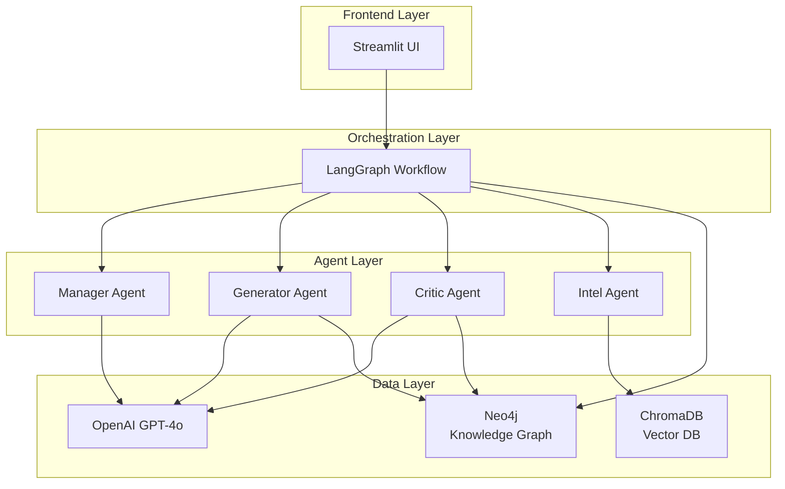
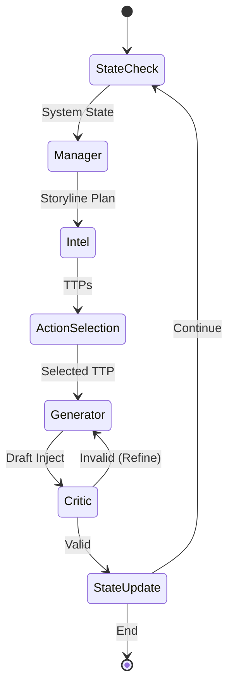

# DORA-konformer Szenariengenerator für Krisenmanagement (MVP)

Ein Prototyp zur Generierung realistischer, logisch konsistenter Krisenszenarien (MSELs) für Finanzunternehmen, die den Anforderungen des **Digital Operational Resilience Act (DORA)** entsprechen.

> 📁 **Projektstruktur:** Die Projektstruktur wurde neu organisiert. Siehe [PROJECT_STRUCTURE.md](PROJECT_STRUCTURE.md) für Details.

## 🎯 Projektziel

Das System verwendet **Generative KI (LLMs)**, **Multi-Agenten-Systeme** und **Knowledge Graphs**, um:
- Realistische Krisenszenarien zu generieren
- Logische Konsistenz sicherzustellen
- DORA-Konformität zu validieren
- Second-Order Effects zu modellieren

## 🏗️ Architektur

### High-Level Übersicht



**📊 Detaillierte Architektur-Diagramme**: Siehe [Architektur-Dokumentation](docs/architecture/ARCHITECTURE.md)

### Tech Stack

- **Sprache:** Python 3.10+
- **Frontend:** Streamlit
- **Orchestrierung:** LangGraph (Multi-Agenten-System)
- **LLM:** OpenAI GPT-4o oder Llama 3
- **Knowledge Graph:** Neo4j
- **Vektor-Datenbank:** ChromaDB (für RAG)
- **Validierung:** Pydantic

### Komponenten

1. **State Models** (`state_models.py`): Pydantic-Modelle für Injects, State Management, Knowledge Graph Entitäten
2. **Neo4j Client** (`neo4j_client.py`): Verwaltung des Knowledge Graph States
3. **LangGraph Workflow**: Orchestrierung der Agenten (Manager, Generator, Critic, Intel)
4. **Streamlit Frontend**: Parametereingabe und Visualisierung

## 🚀 Setup-Anleitung

Diese Anleitung führt Sie Schritt für Schritt durch die Installation des CRUX-Systems auf einem neuen Computer.

> ⚡ **Schnellstart:** Für eine automatisierte Installation können Sie das Setup-Skript verwenden:
> - **macOS/Linux:** `./setup.sh`
> - **Windows:** `setup.bat`
> 
> Das Skript prüft Voraussetzungen, installiert Dependencies und konfiguriert die Umgebung automatisch.

### Voraussetzungen

Bevor Sie beginnen, stellen Sie sicher, dass folgende Software installiert ist:

- **Python 3.10 oder höher** ([Download](https://www.python.org/downloads/))
- **Node.js 18 oder höher** und npm ([Download](https://nodejs.org/))
- **Docker Desktop** ([Download](https://www.docker.com/products/docker-desktop/))
- **Git** ([Download](https://git-scm.com/downloads))

**Überprüfen Sie die Installation:**
```bash
python --version  # Sollte 3.10+ sein
node --version    # Sollte 18+ sein
npm --version
docker --version
```

---

### Schritt 1: Repository klonen

```bash
# Klone das Repository (oder entpacke das ZIP-Archiv)
git clone <repository-url>
cd BA

# Oder falls Sie bereits das Repository haben:
cd BA
```

---

### Schritt 2: Backend Setup

#### 2.1 Python Virtual Environment erstellen

```bash
# Erstelle Virtual Environment
python3 -m venv venv

# Aktiviere Virtual Environment
# Auf macOS/Linux:
source venv/bin/activate

# Auf Windows:
# venv\Scripts\activate
```

**Hinweis:** Sie sollten `(venv)` am Anfang Ihrer Kommandozeile sehen, wenn das Virtual Environment aktiviert ist.

#### 2.2 Python Dependencies installieren

```bash
# Stelle sicher, dass das Virtual Environment aktiviert ist
pip install --upgrade pip
pip install -r requirements.txt
```

**Installationszeit:** Dies kann 5-10 Minuten dauern, je nach Internetverbindung.

#### 2.3 Umgebungsvariablen konfigurieren

```bash
# Kopiere die Beispiel-Umgebungsdatei
cp .env.example .env

# Bearbeite die .env Datei mit Ihrem bevorzugten Editor
# macOS/Linux:
nano .env
# oder
code .env  # Falls VS Code installiert ist

# Windows:
notepad .env
```

**Wichtige Konfigurationen in `.env`:**

```env
# Neo4j (Standard-Werte funktionieren für lokale Installation)
NEO4J_URI=bolt://localhost:7687
NEO4J_USER=neo4j
NEO4J_PASSWORD=password

# OpenAI API Key (ERFORDERLICH für LLM-Funktionalität)
# Erhalten Sie einen Key unter: https://platform.openai.com/api-keys
OPENAI_API_KEY=sk-your-actual-api-key-here

# ChromaDB (Optional, Standard funktioniert)
CHROMA_DB_PATH=./chroma_db
```

**⚠️ Wichtig:** 
- Ersetzen Sie `your_openai_api_key_here` mit Ihrem echten OpenAI API Key
- Die `.env` Datei sollte **NICHT** in Git committed werden (bereits in `.gitignore`)

---

### Schritt 3: Neo4j Datenbank starten

#### 3.1 Docker Desktop starten

Stellen Sie sicher, dass Docker Desktop läuft:
- **macOS/Windows:** Öffnen Sie Docker Desktop
- **Linux:** Starten Sie den Docker Daemon: `sudo systemctl start docker`

#### 3.2 Neo4j Container starten

```bash
# Verwenden Sie das bereitgestellte Skript (empfohlen)
chmod +x scripts/start_neo4j.sh
./scripts/start_neo4j.sh

# Oder manuell mit Docker:
docker run -d \
  --name neo4j \
  -p 7474:7474 -p 7687:7687 \
  -e NEO4J_AUTH=neo4j/password \
  neo4j:latest
```

**Verifizierung:**
- Neo4j Browser sollte unter `http://localhost:7474` erreichbar sein
- Login: Username `neo4j`, Password `password` (oder Ihr gewähltes Passwort)

**Hinweis:** Beim ersten Start kann Neo4j 30-60 Sekunden zum Initialisieren benötigen.

---

### Schritt 4: Frontend Setup (Next.js)

#### 4.1 In Frontend-Verzeichnis wechseln

```bash
cd crux-frontend
```

#### 4.2 Node.js Dependencies installieren

```bash
npm install
```

**Installationszeit:** Dies kann 2-5 Minuten dauern.

#### 4.3 Frontend-Konfiguration prüfen

Das Frontend ist bereits konfiguriert und sollte ohne weitere Anpassungen funktionieren. Die API-Verbindung erfolgt automatisch zu `http://localhost:8000`.

---

### Schritt 5: Setup verifizieren

#### 5.1 Backend Setup prüfen

```bash
# Zurück zum Hauptverzeichnis
cd ..

# Stelle sicher, dass Virtual Environment aktiviert ist
source venv/bin/activate  # macOS/Linux
# oder venv\Scripts\activate  # Windows

# Führe Setup-Check aus
python scripts/check_setup.py
```

**Erwartete Ausgabe:**
```
✅ Pydantic-Modelle: OK
✅ Neo4j: Verbindung erfolgreich!
✅ OpenAI: Konfiguriert
🎉 Alles bereit für die Entwicklung!
```

#### 5.2 Optional: Tests ausführen

```bash
# Führe Unit-Tests aus (optional)
python -m pytest tests/ -v

# Oder nur Setup-Test
python tests/test_setup.py
```

---

### Schritt 6: System starten

#### 6.1 Backend API Server starten

**Terminal 1:**
```bash
# Stelle sicher, dass Virtual Environment aktiviert ist
source venv/bin/activate  # macOS/Linux
# oder venv\Scripts\activate  # Windows

# Starte API Server
python api_server.py
```

**Erwartete Ausgabe:**
```
INFO:     Started server process [xxxxx]
INFO:     Waiting for application startup.
INFO:     Application startup complete.
INFO:     Uvicorn running on http://127.0.0.1:8000
```

**Backend läuft jetzt auf:** `http://localhost:8000`
**API Dokumentation:** `http://localhost:8000/docs`

#### 6.2 Frontend Development Server starten

**Terminal 2:**
```bash
cd crux-frontend
npm run dev
```

**Erwartete Ausgabe:**
```
▲ Next.js 16.1.0 (Turbopack)
- Local:         http://localhost:3000
✓ Ready in XXXXms
```

**Frontend läuft jetzt auf:** `http://localhost:3000`

---

### Schritt 7: System verwenden

1. **Öffnen Sie den Browser:** `http://localhost:3000`
2. **Das Frontend sollte automatisch mit dem Backend verbinden**
3. **Falls "Backend Offline" angezeigt wird:**
   - Prüfen Sie, ob der API Server läuft (Terminal 1)
   - Prüfen Sie die Browser-Konsole auf Fehler (F12)
   - Verwenden Sie den Demo-Mode als Fallback

---

### Troubleshooting

#### Problem: Python-Version zu alt

**Fehler:** `Python 3.10+ wird benötigt`

**Lösung:**
```bash
# Prüfe Python-Version
python3 --version

# Falls < 3.10, installieren Sie Python 3.10+ von python.org
# Verwenden Sie dann python3 statt python
python3 -m venv venv
```

#### Problem: Neo4j-Verbindungsfehler

**Fehler:** `Neo4j connection failed`

**Lösung:**
1. Prüfen Sie, ob Docker läuft: `docker ps`
2. Prüfen Sie, ob Neo4j Container läuft: `docker ps | grep neo4j`
3. Starten Sie Neo4j neu: `./scripts/start_neo4j.sh`
4. Prüfen Sie die `.env` Datei auf korrekte Credentials
5. Prüfen Sie die Neo4j Browser UI: `http://localhost:7474`

#### Problem: OpenAI API Fehler

**Fehler:** `OpenAI API key not found` oder `Invalid API key`

**Lösung:**
1. Prüfen Sie die `.env` Datei: `cat .env | grep OPENAI`
2. Stellen Sie sicher, dass der API Key korrekt ist (beginnt mit `sk-`)
3. Erhalten Sie einen neuen Key: https://platform.openai.com/api-keys
4. Stellen Sie sicher, dass Sie Credits auf Ihrem OpenAI Account haben

#### Problem: Frontend zeigt CSS-Fehler

**Fehler:** `@import rules must precede all rules`

**Lösung:**
```bash
cd crux-frontend
rm -rf .next node_modules/.cache .turbo
npm run dev
```

#### Problem: Port bereits belegt

**Fehler:** `Address already in use`

**Lösung:**
```bash
# Finde Prozess auf Port 8000 (Backend)
lsof -ti:8000 | xargs kill -9  # macOS/Linux
# oder
netstat -ano | findstr :8000  # Windows, dann Task beenden

# Finde Prozess auf Port 3000 (Frontend)
lsof -ti:3000 | xargs kill -9  # macOS/Linux
# oder
netstat -ano | findstr :3000  # Windows, dann Task beenden
```

#### Problem: ModuleNotFoundError

**Fehler:** `ModuleNotFoundError: No module named 'fastapi'`

**Lösung:**
```bash
# Stelle sicher, dass Virtual Environment aktiviert ist
source venv/bin/activate  # macOS/Linux
# oder venv\Scripts\activate  # Windows

# Installiere fehlende Dependencies
pip install -r requirements.txt
```

---

### Nächste Schritte

Nach erfolgreichem Setup:

1. **Lesen Sie die Dokumentation:**
   - [Vollständige Dokumentation](docs/COMPLETE_DOCUMENTATION.md)
   - [Quick Start Guide](docs/getting-started/QUICK_START.md)
   - [Anwendungsanleitung](docs/user-guides/ANWENDUNGSANLEITUNG.md)

2. **Testen Sie das System:**
   - Generieren Sie ein Test-Szenario über das Frontend
   - Prüfen Sie die API-Dokumentation: `http://localhost:8000/docs`

3. **Entwicklung:**
   - Backend-Code: Hauptverzeichnis (`api_server.py`, `agents/`, `workflows/`)
   - Frontend-Code: `crux-frontend/` Verzeichnis

---

### Wichtige URLs nach dem Start

- **Frontend:** http://localhost:3000
- **Backend API:** http://localhost:8000
- **API Dokumentation:** http://localhost:8000/docs
- **API Health Check:** http://localhost:8000/health
- **Neo4j Browser:** http://localhost:7474

---

### Hilfe und Support

Bei Problemen:
1. Prüfen Sie die [Troubleshooting-Sektion](#troubleshooting) oben
2. Lesen Sie die [Dokumentation](docs/README.md)
3. Prüfen Sie die Logs in den Terminal-Fenstern
4. Prüfen Sie die Browser-Konsole (F12) für Frontend-Fehler

## 📋 Verwendung

### Frontend-Anwendungen

Das Projekt bietet zwei Streamlit-Frontends:

#### 1. DORA Scenario Generator (`app.py`)

Die Hauptanwendung für die Enterprise-Grade Szenario-Generierung:

1. Starte die App: `streamlit run app.py`
2. Wähle Szenario-Typ und Anzahl Injects
3. Klicke auf "Szenario generieren"
4. Prüfe Ergebnisse im "Ergebnisse" Tab
5. Exportiere bei Bedarf (CSV/JSON/MSEL)

**Features:**
- Multi-Agenten-System mit LangGraph
- Interaktiver Modus mit Decision-Points
- DORA-Compliance Validierung
- Neo4j State Management

#### 2. Crisis Cockpit (`frontend/crisis_cockpit.py`)

Spezielles Frontend für Bachelor-Thesis Evaluation:

1. Starte die App: `streamlit run crisis_cockpit.py`
2. Split-Screen Layout: Story Feed + State Reality
3. Evaluation durchführen: Legacy Mode vs. Logic Guard Mode
4. CSV-Export für Thesis-Daten

**Features:**
- Split-Screen Visualisierung
- Dungeon Master Mode (manuelle Event-Injection)
- Hallucination-Rating-System
- Debug-Informationen (Raw JSON, Logic Checks)

**📖 Detaillierte Anleitung:** Siehe [Anwendungsanleitung](docs/user-guides/ANWENDUNGSANLEITUNG.md)

### Programmgesteuerte Nutzung

#### State Models

Die Pydantic-Modelle in `state_models.py` definieren:

- **`Inject`**: MSEL-Inject Schema mit Validierung
- **`ScenarioState`**: Zustand eines laufenden Szenarios
- **`KnowledgeGraphEntity`**: Entität für den Neo4j Graph
- **`ValidationResult`**: Ergebnis der Critic-Agent Validierung

#### Neo4j Client

Der `Neo4jClient` verwaltet den Systemzustand:

```python
from neo4j_client import Neo4jClient

with Neo4jClient() as client:
    # Aktuellen State abfragen
    entities = client.get_current_state()
    
    # Status einer Entität aktualisieren
    client.update_entity_status("SRV-001", "offline", inject_id="INJ-005")
    
    # Second-Order Effects abfragen
    affected = client.get_affected_entities("SRV-001")
```

#### Workflow

```python
from workflows.scenario_workflow import ScenarioWorkflow
from state_models import ScenarioType

workflow = ScenarioWorkflow(neo4j_client=neo4j, max_iterations=10)
result = workflow.generate_scenario(ScenarioType.RANSOMWARE_DOUBLE_EXTORTION)
```

## 🔄 Workflow (implementiert)

Der LangGraph-basierte Workflow orchestriert folgende Schritte:



**Detaillierte Schritte:**

1. **State Check**: Abfrage des aktuellen Systemzustands aus Neo4j
2. **Manager Agent**: Erstellt Storyline-Plan basierend auf Szenario-Typ und Phase
3. **Intel Agent**: Stellt relevante MITRE ATT&CK TTPs bereit
4. **Action Selection**: Auswahl des nächsten logischen Angriffsschritts
5. **Generator Agent**: Erstellt detaillierten Inject mit LLM
6. **Critic Agent**: Validiert Logik, DORA-Konformität und Causal Validity
7. **State Update**: Schreibt Auswirkungen in Neo4j (inkl. Second-Order Effects)
8. **Refine Loop**: Bei Validierungsfehlern zurück zum Generator (max. 2 Versuche)

**📊 Vollständige Workflow-Diagramme**: Siehe [Architektur-Dokumentation](docs/architecture/ARCHITECTURE.md)

## 📊 Szenario-Typen

- Ransomware & Double Extortion
- DDoS auf kritische Funktionen
- Supply Chain Compromise
- Insider Threat / Datenmanipulation

## 🧪 Qualitäts-Metriken

- **Logical Consistency**: Widerspruchsfreiheit zur Historie
- **Causal Validity**: MITRE ATT&CK Graph Konformität
- **DORA Compliance**: Artikel 25 Anforderungen

## 🎯 Schnellstart

### Frontend starten

```bash
# Virtual Environment aktivieren
source venv/bin/activate

# Option 1: DORA Scenario Generator (Hauptanwendung)
streamlit run app.py

# Option 2: Crisis Cockpit (Thesis-Evaluation)
streamlit run frontend/crisis_cockpit.py
```

Die Apps öffnen sich automatisch im Browser unter `http://localhost:8501`

**📖 Vollständige Anleitung:** Siehe [Anwendungsanleitung](docs/user-guides/ANWENDUNGSANLEITUNG.md)

### Programmgesteuert verwenden

```python
from neo4j_client import Neo4jClient
from workflows.scenario_workflow import ScenarioWorkflow
from state_models import ScenarioType

# Initialisiere
neo4j = Neo4jClient()
neo4j.connect()

workflow = ScenarioWorkflow(neo4j_client=neo4j, max_iterations=10)

# Generiere Szenario
result = workflow.generate_scenario(
    scenario_type=ScenarioType.RANSOMWARE_DOUBLE_EXTORTION
)

# Verarbeite Ergebnisse
for inject in result['injects']:
    print(f"{inject.inject_id}: {inject.content}")
```

## ✅ Implementierte Features

### Backend
- ✅ LangGraph Workflow mit Multi-Agenten-System
- ✅ 4 Agenten: Manager, Generator, Critic, Intel
- ✅ Neo4j Knowledge Graph für State Management
- ✅ FSM-basierte Phasen-Übergänge
- ✅ DORA-Compliance Validierung
- ✅ MITRE ATT&CK Integration
- ✅ Second-Order Effects Tracking

### Frontend
- ✅ DORA Scenario Generator (`app.py`) - Enterprise-Grade UI
- ✅ Crisis Cockpit (`crisis_cockpit.py`) - Thesis-Evaluation-Tool
- ✅ Split-Screen Layout mit Live-State-Updates
- ✅ Interaktiver Modus mit Decision-Points
- ✅ Export-Funktionalität (CSV, JSON, MSEL, Excel)
- ✅ Hallucination-Rating-System für Thesis-Evaluation
- ✅ Debug-Informationen und Transparency-Features

## 📝 Nächste Schritte / Verbesserungspotenzial

Siehe [PROJECT_STATUS.md](PROJECT_STATUS.md) für detaillierte Informationen zu:
- What we can do reliably
- What we cover partially (work in progress)
- What's missing (not yet implemented)
- What would be nice to have
- Implementation priority matrix

## 📚 Dokumentation

Die Dokumentation ist jetzt strukturiert im `docs/` Verzeichnis organisiert:

- **[📚 Dokumentationsübersicht](docs/README.md)** - Zentrale Übersicht aller Dokumentation
- **[🚀 Quick Start](docs/getting-started/QUICK_START.md)** - 5-Minuten-Schnellstart
- **[📖 Anwendungsanleitung](docs/user-guides/ANWENDUNGSANLEITUNG.md)** - Vollständige Anwendungsanleitung
- **[🏗️ Architektur](docs/architecture/ARCHITECTURE.md)** - Architektur-Dokumentation
- **[📊 Projekt-Status](PROJECT_STATUS.md)** - Projekt-Status
- **[🎓 Thesis](docs/thesis/THESIS_DOCUMENTATION.md)** - Thesis-Dokumentation
- **[🎮 Crisis Cockpit](docs/user-guides/CRISIS_COCKPIT_README.md)** - Crisis Cockpit Guide

## 📄 Lizenz

[Zu definieren]

