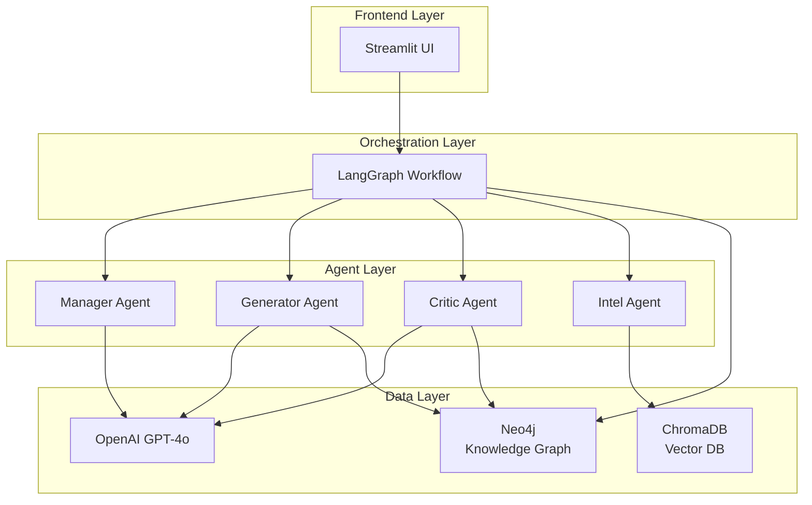
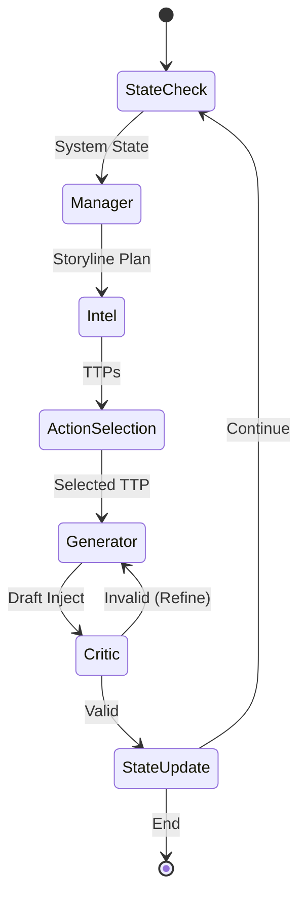

# DORA-konformer Szenariengenerator für Krisenmanagement (MVP)

Ein Prototyp zur Generierung realistischer, logisch konsistenter Krisenszenarien (MSELs) für Finanzunternehmen, die den Anforderungen des **Digital Operational Resilience Act (DORA)** entsprechen.

> 📁 **Projektstruktur:** Die Projektstruktur wurde neu organisiert. Siehe [PROJECT_STRUCTURE.md](PROJECT_STRUCTURE.md) für Details.

## 🎯 Projektziel

Das System verwendet **Generative KI (LLMs)**, **Multi-Agenten-Systeme** und **Knowledge Graphs**, um:
- Realistische Krisenszenarien zu generieren
- Logische Konsistenz sicherzustellen
- DORA-Konformität zu validieren
- Second-Order Effects zu modellieren

## 🏗️ Architektur

### High-Level Übersicht



**📊 Detaillierte Architektur-Diagramme**: Siehe [Architektur-Dokumentation](docs/architecture/ARCHITECTURE.md)

### Tech Stack

- **Sprache:** Python 3.10+
- **Frontend:** Streamlit
- **Orchestrierung:** LangGraph (Multi-Agenten-System)
- **LLM:** OpenAI GPT-4o oder Llama 3
- **Knowledge Graph:** Neo4j
- **Vektor-Datenbank:** ChromaDB (für RAG)
- **Validierung:** Pydantic

### Komponenten

1. **State Models** (`state_models.py`): Pydantic-Modelle für Injects, State Management, Knowledge Graph Entitäten
2. **Neo4j Client** (`neo4j_client.py`): Verwaltung des Knowledge Graph States
3. **LangGraph Workflow**: Orchestrierung der Agenten (Manager, Generator, Critic, Intel)
4. **Streamlit Frontend**: Parametereingabe und Visualisierung

## 🚀 Setup

### 1. Installation

```bash
# Virtual Environment erstellen
python -m venv venv
source venv/bin/activate  # Auf Windows: venv\Scripts\activate

# Dependencies installieren
pip install -r requirements.txt
```

### 2. Umgebungsvariablen

Kopiere `.env.example` zu `.env` und fülle die Werte aus:

```bash
cp .env.example .env
```

Bearbeite `.env`:
- `NEO4J_URI`: Neo4j Verbindungs-URI (Standard: `bolt://localhost:7687`)
- `NEO4J_USER`: Neo4j Benutzername
- `NEO4J_PASSWORD`: Neo4j Passwort
- `OPENAI_API_KEY`: OpenAI API Key

### 3. Neo4j Setup

Stelle sicher, dass Neo4j läuft:

```bash
# Mit Docker
docker run -d \
  --name neo4j \
  -p 7474:7474 -p 7687:7687 \
  -e NEO4J_AUTH=neo4j/password \
  neo4j:latest
```

### 4. Neo4j starten

```bash
# Mit dem bereitgestellten Skript
./start_neo4j.sh

# Oder manuell mit Docker
docker run -d \
  --name neo4j \
  -p 7474:7474 -p 7687:7687 \
  -e NEO4J_AUTH=neo4j/password \
  neo4j:latest
```

### 5. Setup testen

```bash
# Prüfe ob alles funktioniert
python check_setup.py

# Teste den Workflow
python test_workflow.py
```

## 📋 Verwendung

### Frontend-Anwendungen

Das Projekt bietet zwei Streamlit-Frontends:

#### 1. DORA Scenario Generator (`app.py`)

Die Hauptanwendung für die Enterprise-Grade Szenario-Generierung:

1. Starte die App: `streamlit run app.py`
2. Wähle Szenario-Typ und Anzahl Injects
3. Klicke auf "Szenario generieren"
4. Prüfe Ergebnisse im "Ergebnisse" Tab
5. Exportiere bei Bedarf (CSV/JSON/MSEL)

**Features:**
- Multi-Agenten-System mit LangGraph
- Interaktiver Modus mit Decision-Points
- DORA-Compliance Validierung
- Neo4j State Management

#### 2. Crisis Cockpit (`crisis_cockpit.py`)

Spezielles Frontend für Bachelor-Thesis Evaluation:

1. Starte die App: `streamlit run crisis_cockpit.py`
2. Split-Screen Layout: Story Feed + State Reality
3. Evaluation durchführen: Legacy Mode vs. Logic Guard Mode
4. CSV-Export für Thesis-Daten

**Features:**
- Split-Screen Visualisierung
- Dungeon Master Mode (manuelle Event-Injection)
- Hallucination-Rating-System
- Debug-Informationen (Raw JSON, Logic Checks)

**📖 Detaillierte Anleitung:** Siehe [Anwendungsanleitung](docs/user-guides/ANWENDUNGSANLEITUNG.md)

### Programmgesteuerte Nutzung

#### State Models

Die Pydantic-Modelle in `state_models.py` definieren:

- **`Inject`**: MSEL-Inject Schema mit Validierung
- **`ScenarioState`**: Zustand eines laufenden Szenarios
- **`KnowledgeGraphEntity`**: Entität für den Neo4j Graph
- **`ValidationResult`**: Ergebnis der Critic-Agent Validierung

#### Neo4j Client

Der `Neo4jClient` verwaltet den Systemzustand:

```python
from neo4j_client import Neo4jClient

with Neo4jClient() as client:
    # Aktuellen State abfragen
    entities = client.get_current_state()
    
    # Status einer Entität aktualisieren
    client.update_entity_status("SRV-001", "offline", inject_id="INJ-005")
    
    # Second-Order Effects abfragen
    affected = client.get_affected_entities("SRV-001")
```

#### Workflow

```python
from workflows.scenario_workflow import ScenarioWorkflow
from state_models import ScenarioType

workflow = ScenarioWorkflow(neo4j_client=neo4j, max_iterations=10)
result = workflow.generate_scenario(ScenarioType.RANSOMWARE_DOUBLE_EXTORTION)
```

## 🔄 Workflow (implementiert)

Der LangGraph-basierte Workflow orchestriert folgende Schritte:



**Detaillierte Schritte:**

1. **State Check**: Abfrage des aktuellen Systemzustands aus Neo4j
2. **Manager Agent**: Erstellt Storyline-Plan basierend auf Szenario-Typ und Phase
3. **Intel Agent**: Stellt relevante MITRE ATT&CK TTPs bereit
4. **Action Selection**: Auswahl des nächsten logischen Angriffsschritts
5. **Generator Agent**: Erstellt detaillierten Inject mit LLM
6. **Critic Agent**: Validiert Logik, DORA-Konformität und Causal Validity
7. **State Update**: Schreibt Auswirkungen in Neo4j (inkl. Second-Order Effects)
8. **Refine Loop**: Bei Validierungsfehlern zurück zum Generator (max. 2 Versuche)

**📊 Vollständige Workflow-Diagramme**: Siehe [Architektur-Dokumentation](docs/architecture/ARCHITECTURE.md)

## 📊 Szenario-Typen

- Ransomware & Double Extortion
- DDoS auf kritische Funktionen
- Supply Chain Compromise
- Insider Threat / Datenmanipulation

## 🧪 Qualitäts-Metriken

- **Logical Consistency**: Widerspruchsfreiheit zur Historie
- **Causal Validity**: MITRE ATT&CK Graph Konformität
- **DORA Compliance**: Artikel 25 Anforderungen

## 🎯 Schnellstart

### Frontend starten

```bash
# Virtual Environment aktivieren
source venv/bin/activate

# Option 1: DORA Scenario Generator (Hauptanwendung)
streamlit run app.py

# Option 2: Crisis Cockpit (Thesis-Evaluation)
streamlit run crisis_cockpit.py
```

Die Apps öffnen sich automatisch im Browser unter `http://localhost:8501`

**📖 Vollständige Anleitung:** Siehe [Anwendungsanleitung](docs/user-guides/ANWENDUNGSANLEITUNG.md)

### Programmgesteuert verwenden

```python
from neo4j_client import Neo4jClient
from workflows.scenario_workflow import ScenarioWorkflow
from state_models import ScenarioType

# Initialisiere
neo4j = Neo4jClient()
neo4j.connect()

workflow = ScenarioWorkflow(neo4j_client=neo4j, max_iterations=10)

# Generiere Szenario
result = workflow.generate_scenario(
    scenario_type=ScenarioType.RANSOMWARE_DOUBLE_EXTORTION
)

# Verarbeite Ergebnisse
for inject in result['injects']:
    print(f"{inject.inject_id}: {inject.content}")
```

## ✅ Implementierte Features

### Backend
- ✅ LangGraph Workflow mit Multi-Agenten-System
- ✅ 4 Agenten: Manager, Generator, Critic, Intel
- ✅ Neo4j Knowledge Graph für State Management
- ✅ FSM-basierte Phasen-Übergänge
- ✅ DORA-Compliance Validierung
- ✅ MITRE ATT&CK Integration
- ✅ Second-Order Effects Tracking

### Frontend
- ✅ DORA Scenario Generator (`app.py`) - Enterprise-Grade UI
- ✅ Crisis Cockpit (`crisis_cockpit.py`) - Thesis-Evaluation-Tool
- ✅ Split-Screen Layout mit Live-State-Updates
- ✅ Interaktiver Modus mit Decision-Points
- ✅ Export-Funktionalität (CSV, JSON, MSEL, Excel)
- ✅ Hallucination-Rating-System für Thesis-Evaluation
- ✅ Debug-Informationen und Transparency-Features

## 📝 Nächste Schritte / Verbesserungspotenzial

Siehe [PROJECT_STATUS.md](PROJECT_STATUS.md) für detaillierte Informationen zu:
- What we can do reliably
- What we cover partially (work in progress)
- What's missing (not yet implemented)
- What would be nice to have
- Implementation priority matrix

## 📚 Dokumentation

Die Dokumentation ist jetzt strukturiert im `docs/` Verzeichnis organisiert:

- **[📚 Dokumentationsübersicht](docs/README.md)** - Zentrale Übersicht aller Dokumentation
- **[🚀 Quick Start](docs/getting-started/QUICK_START.md)** - 5-Minuten-Schnellstart
- **[📖 Anwendungsanleitung](docs/user-guides/ANWENDUNGSANLEITUNG.md)** - Vollständige Anwendungsanleitung
- **[🏗️ Architektur](docs/architecture/ARCHITECTURE.md)** - Architektur-Dokumentation
- **[📊 Projekt-Status](PROJECT_STATUS.md)** - Projekt-Status
- **[🎓 Thesis](docs/thesis/THESIS_DOCUMENTATION.md)** - Thesis-Dokumentation
- **[🎮 Crisis Cockpit](docs/user-guides/CRISIS_COCKPIT_README.md)** - Crisis Cockpit Guide

## 📄 Lizenz

[Zu definieren]

