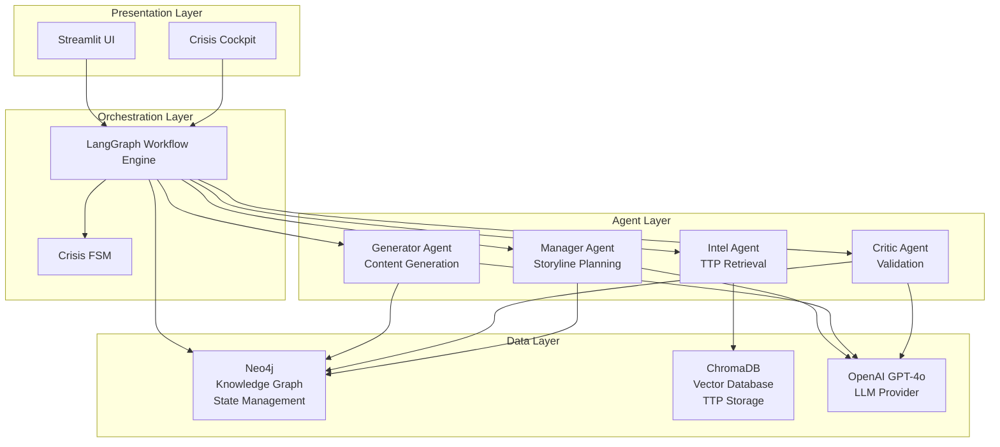
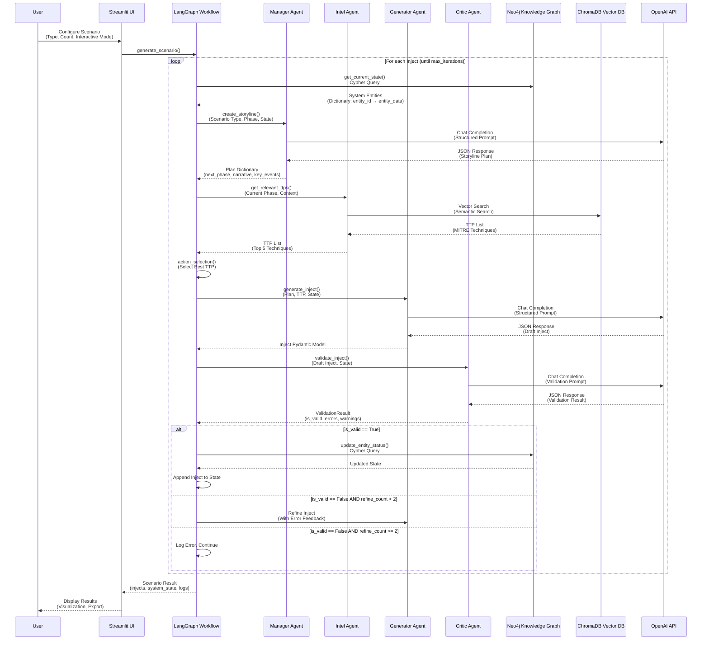
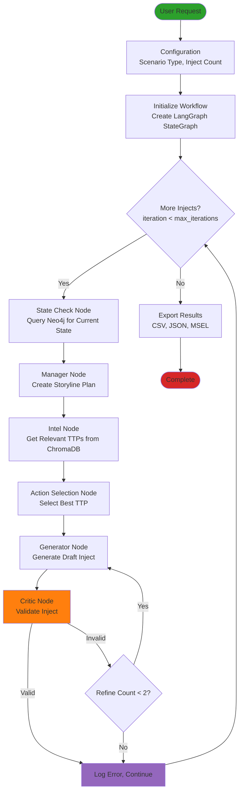
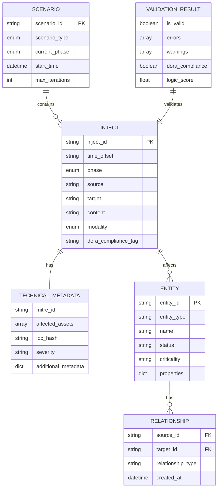

# Systemarchitektur-Dokumentation

## DORA-konformer Szenariengenerator für Krisenmanagement

**Version:** 1.0  
**Datum:** Dezember 2024  
**Autor:** Bachelor-Thesis "Neuro-Symbolic Crisis Generator"

---

## Inhaltsverzeichnis

1. [Einleitung](#einleitung)
2. [System-Architektur-Übersicht](#system-architektur-übersicht)
3. [Architektur-Prinzipien](#architektur-prinzipien)
4. [Komponenten-Architektur](#komponenten-architektur)
5. [Datenfluss und Interaktionen](#datenfluss-und-interaktionen)
6. [State Management](#state-management)
7. [Workflow-Orchestrierung](#workflow-orchestrierung)
8. [Datenmodell](#datenmodell)
9. [Technologie-Stack](#technologie-stack)
10. [Design-Entscheidungen](#design-entscheidungen)
11. [Sicherheits-Architektur](#sicherheits-architektur)
12. [Skalierbarkeit und Erweiterbarkeit](#skalierbarkeit-und-erweiterbarkeit)

---

## Einleitung

### Forschungsziel

Diese Dokumentation beschreibt die Systemarchitektur eines Prototyps zur Generierung realistischer, logisch konsistenter Krisenszenarien (MSELs - Master Scenario Event Lists) für Finanzunternehmen. Das System implementiert einen **Neuro-Symbolic Ansatz**, der Generative KI (Large Language Models) mit symbolischen Constraints (Knowledge Graphs, Finite State Machines) kombiniert, um Hallucinations zu reduzieren und DORA-Konformität sicherzustellen.

### Architektur-Philosophie

Das System basiert auf folgenden Prinzipien:

1. **Separation of Concerns:** Klare Trennung zwischen Orchestrierung, Agenten-Logik und Datenpersistenz
2. **Multi-Agenten-System:** Spezialisierte Agenten für verschiedene Aufgaben (Planning, Generation, Validation, Intelligence)
3. **State-Centric Design:** Zentrale State-Verwaltung über Neo4j Knowledge Graph
4. **Constraint-Based Validation:** Mehrschichtige Validierung (Schema, FSM, Knowledge Graph, DORA Compliance)
5. **Extensibility:** Modulare Architektur für zukünftige Erweiterungen

---

## System-Architektur-Übersicht

### High-Level Architektur

Das System folgt einer **Layered Architecture** mit vier Hauptebenen:

```
┌─────────────────────────────────────────────────────────────┐
│                    Presentation Layer                        │
│  ┌────────────────────────────────────────────────────────┐  │
│  │         Streamlit Frontend (app.py)                   │  │
│  │         Crisis Cockpit (crisis_cockpit.py)            │  │
│  └────────────────────────────────────────────────────────┘  │
└─────────────────────────────────────────────────────────────┘
                            │
                            ▼
┌─────────────────────────────────────────────────────────────┐
│                 Orchestration Layer                          │
│  ┌────────────────────────────────────────────────────────┐  │
│  │         LangGraph Workflow Engine                      │  │
│  │         - State Management                             │  │
│  │         - Node Orchestration                           │  │
│  │         - Conditional Routing                          │  │
│  └────────────────────────────────────────────────────────┘  │
└─────────────────────────────────────────────────────────────┘
                            │
        ┌───────────────────┼───────────────────┐
        ▼                   ▼                   ▼
┌──────────────┐  ┌──────────────┐  ┌──────────────┐
│   Manager    │  │   Generator  │  │    Critic    │
│    Agent     │  │    Agent     │  │    Agent     │
└──────────────┘  └──────────────┘  └──────────────┘
        │                   │                   │
        └───────────────────┼───────────────────┘
                            ▼
┌─────────────────────────────────────────────────────────────┐
│                    Data & Intelligence Layer                 │
│  ┌──────────┐  ┌──────────┐  ┌──────────┐  ┌──────────┐  │
│  │  Neo4j   │  │ ChromaDB │  │  OpenAI  │  │   Intel  │  │
│  │Knowledge │  │  Vector  │  │   API    │  │   Agent  │  │
│  │  Graph   │  │    DB    │  │          │  │          │  │
│  └──────────┘  └──────────┘  └──────────┘  └──────────┘  │
└─────────────────────────────────────────────────────────────┘
```

### Architektur-Diagramm



---

## Architektur-Prinzipien

### 1. Neuro-Symbolic Integration

Das System kombiniert **neurale** (LLM-basierte) und **symbolische** (regelbasierte) Ansätze:

- **Neural:** LLM-basierte Content-Generierung (Manager, Generator, Critic Agents)
- **Symbolic:** 
  - Finite State Machine für Phasen-Validierung
  - Neo4j Knowledge Graph für State-Konsistenz
  - Pydantic Schema für strukturelle Validierung
  - DORA Compliance Rules für regulatorische Validierung

### 2. Multi-Agenten-System

Vier spezialisierte Agenten mit klaren Verantwortlichkeiten:

| Agent | Verantwortlichkeit | Input | Output |
|-------|-------------------|-------|--------|
| **Manager** | Storyline-Planning, Phasen-Übergänge | System State, Scenario Type | Storyline Plan, Next Phase |
| **Intel** | TTP-Retrieval aus Vector DB | Current Phase, Context | Relevante MITRE ATT&CK TTPs |
| **Generator** | Inject-Generierung | Storyline, TTP, System State | Draft Inject (Pydantic Model) |
| **Critic** | Multi-Layer Validation | Draft Inject, System State | Validation Result |

### 3. State-Centric Design

Der **System State** ist die zentrale Wahrheitsquelle:

- **Neo4j Knowledge Graph** speichert:
  - Entities (Server, Applications, Departments)
  - Relationships (RUNS_ON, USES, DEPENDS_ON)
  - Status (online, offline, compromised, degraded)
  - Timestamps und Historie

- **State Updates** erfolgen nach jedem validierten Inject:
  - Direkte Auswirkungen (betroffene Assets)
  - Second-Order Effects (kaskadierende Auswirkungen)
  - Dependency-Graph-Traversal für Impact-Analyse

### 4. Constraint-Based Validation

Mehrschichtige Validierung reduziert Hallucinations:

1. **Pydantic Schema Validation:** Strukturelle Korrektheit
2. **FSM Phase Validation:** Gültige Phasen-Übergänge
3. **Neo4j State Consistency:** Konsistenz mit Knowledge Graph
4. **MITRE ATT&CK Validation:** Technische Plausibilität
5. **DORA Compliance Check:** Artikel 25 Anforderungen

---

## Komponenten-Architektur

### 1. Presentation Layer

#### 1.1 Streamlit Frontend (app.py)

**Zweck:** Enterprise-Grade UI für Szenario-Generierung

**Komponenten:**
- Parameter-Input (Scenario Type, Anzahl Injects, Interactive Mode)
- Real-time Progress Tracking
- Ergebnis-Visualisierung
- Export-Funktionalität (CSV, JSON, MSEL, Excel)

**Technologie:** Streamlit 1.28+

#### 1.2 Crisis Cockpit (crisis_cockpit.py)

**Zweck:** Thesis-Evaluation-Tool für Hallucination-Analyse

**Features:**
- Split-Screen Layout (Story Feed + State Reality)
- Evaluation Module (Legacy Mode vs. Logic Guard Mode)
- Hallucination-Rating-System
- CSV Export für Thesis-Daten
- Debug-Informationen (Raw JSON, Logic Check Results)

**Technologie:** Streamlit 1.28+, Pandas

### 2. Orchestration Layer

#### 2.1 LangGraph Workflow Engine

**Zweck:** Orchestrierung des Multi-Agenten-Systems

**Architektur:**
- **StateGraph:** Zentrale State-Verwaltung (TypedDict)
- **Nodes:** Atomare Workflow-Schritte
- **Edges:** Lineare und konditionale Übergänge
- **Conditional Edges:** Dynamisches Routing basierend auf State

**Workflow-Nodes:**

1. **state_check:** Abfrage des aktuellen Systemzustands aus Neo4j
2. **manager:** Storyline-Planning durch Manager Agent
3. **intel:** TTP-Retrieval durch Intel Agent
4. **action_selection:** Auswahl des nächsten logischen Angriffsschritts
5. **generator:** Inject-Generierung durch Generator Agent
6. **critic:** Validierung durch Critic Agent
7. **state_update:** State-Update in Neo4j
8. **decision_point:** (Optional) Interaktive Benutzer-Entscheidungen

**Technologie:** LangGraph 0.2+, LangChain 0.3+

#### 2.2 Crisis Finite State Machine (FSM)

**Zweck:** Validierung von Phasen-Übergängen

**Phasen:**
1. `NORMAL_OPERATION` - Baseline State
2. `SUSPICIOUS_ACTIVITY` - Erkannte Anomalien
3. `INITIAL_INCIDENT` - Bestätigter Vorfall
4. `ESCALATION_CRISIS` - Kritische Eskalation
5. `CONTAINMENT` - Eindämmungsmaßnahmen
6. `RECOVERY` - Wiederherstellung

**Validierung:**
- Nur gültige Übergänge erlaubt (z.B. NORMAL_OPERATION → SUSPICIOUS_ACTIVITY ✓, NORMAL_OPERATION → RECOVERY ✗)
- Critic Agent prüft Phasen-Konsistenz
- FSM-Klasse (`workflows/fsm.py`) implementiert Transition-Logik

**Technologie:** Python Enum, Custom FSM Logic

### 3. Agent Layer

#### 3.1 Manager Agent

**Verantwortlichkeit:** Storyline-Planning und Phasen-Management

**Input:**
- Scenario Type (RANSOMWARE_DOUBLE_EXTORTION, DDoS, etc.)
- Current Phase (CrisisPhase Enum)
- System State (Dictionary: entity_id → entity_data)
- Inject Count (Anzahl bereits generierter Injects)

**Prozess:**
1. Formatierung des System States für LLM-Prompt
2. LLM-Aufruf mit strukturiertem Prompt
3. JSON-Parsing der LLM-Response
4. Validierung gegen FSM (Phasen-Übergang)
5. Rückgabe: `{"next_phase": CrisisPhase, "narrative": str, "key_events": List, ...}`

**Output:**
- Next Phase (validiert gegen FSM)
- Narrative (Storyline-Beschreibung)
- Key Events (geplante Ereignisse)
- Affected Assets (voraussichtlich betroffene Assets)
- Business Impact (geschätzter Business-Impact)

**Technologie:** LangChain ChatOpenAI, Pydantic für Response-Parsing

#### 3.2 Intel Agent

**Verantwortlichkeit:** MITRE ATT&CK TTP-Retrieval

**Input:**
- Current Phase (für Phase-Filtering)
- Context (optional, für semantische Suche)

**Prozess:**
1. ChromaDB Vector Search nach relevanten TTPs
2. Phase-Filtering (nur TTPs für aktuelle Phase)
3. Relevanz-Scoring
4. Limitierung auf Top-N TTPs (Standard: 5)

**Output:**
- Liste von TTPs mit:
  - MITRE Technique ID (z.B. "T1078")
  - Technique Name
  - Description
  - Tactic
  - Relevance Score

**Technologie:** ChromaDB 0.4+, Vector Embeddings

#### 3.3 Generator Agent

**Verantwortlichkeit:** Inject-Generierung

**Input:**
- Storyline Plan (vom Manager Agent)
- Selected TTP (vom Action Selection)
- System State
- Historical Context (vorherige Injects)

**Prozess:**
1. Formatierung aller Inputs für LLM-Prompt
2. LLM-Aufruf mit strukturiertem Prompt
3. JSON-Parsing der LLM-Response
4. Pydantic Model Validation (Inject Schema)
5. Rückgabe: `Inject` Pydantic Model

**Output:**
- `Inject` Pydantic Model mit:
  - `inject_id`: Eindeutige ID
  - `time_offset`: Zeitstempel relativ zum Szenario-Start
  - `phase`: CrisisPhase Enum
  - `source`: Absender (z.B. "Red Team / Attacker")
  - `target`: Empfänger (z.B. "Blue Team / SOC")
  - `content`: Vollständiger Inject-Text
  - `modality`: InjectModality Enum (SIEM_ALERT, EMAIL, etc.)
  - `technical_metadata`: TechnicalMetadata (MITRE ID, Affected Assets, etc.)

**Technologie:** LangChain ChatOpenAI, Pydantic 2.0+

#### 3.4 Critic Agent

**Verantwortlichkeit:** Multi-Layer Validation

**Input:**
- Draft Inject (Pydantic Model)
- System State
- Historical Context
- Current Phase

**Validierungsebenen:**

1. **Pydantic Schema Validation:**
   - Automatisch durch Pydantic
   - Strukturelle Korrektheit

2. **FSM Phase Validation:**
   - Prüft ob Inject-Phase konsistent mit Current Phase
   - Prüft Phasen-Übergänge

3. **Neo4j State Consistency:**
   - Prüft ob Affected Assets existieren
   - Prüft ob Status-Änderungen konsistent sind
   - Prüft Second-Order Effects

4. **MITRE ATT&CK Validation:**
   - Prüft technische Plausibilität
   - Prüft TTP-Konsistenz

5. **DORA Compliance Check:**
   - Prüft Artikel 25 Anforderungen
   - Prüft Business Impact

**Prozess:**
1. LLM-basierte Validierung mit strukturiertem Prompt
2. JSON-Parsing der Validation Result
3. Rückgabe: `ValidationResult` Pydantic Model

**Output:**
- `ValidationResult` mit:
  - `is_valid`: Boolean
  - `errors`: List[str] (bei Invalid)
  - `warnings`: List[str]
  - `dora_compliance`: Boolean
  - `logic_score`: Float (0.0 - 1.0)

**Refinement-Logik:**
- Bei `is_valid = False`: Rückgabe zum Generator (max. 2 Versuche)
- Bei `is_valid = True`: Weiterleitung zum State Update

**Technologie:** LangChain ChatOpenAI, Pydantic 2.0+

### 4. Data Layer

#### 4.1 Neo4j Knowledge Graph

**Zweck:** Zentrale State-Verwaltung und Second-Order Effects Tracking

**Datenmodell:**

**Nodes:**
- **Entity Nodes:**
  - Labels: `Entity`, `Server`, `Application`, `Database`, `Department`
  - Properties: `entity_id`, `name`, `entity_type`, `status`, `criticality`, `properties` (JSON)

**Relationships:**
- **RUNS_ON:** Application → Server
- **USES:** Application → Database
- **DEPENDS_ON:** Application → Application
- **MANAGES:** Department → Application
- **AFFECTED_BY:** Entity → Inject (temporal)

**Cypher-Queries:**

```cypher
// Get Current State
MATCH (e:Entity)
RETURN e.entity_id, e.status, e.entity_type, e.name, e.properties

// Update Entity Status
MATCH (e:Entity {entity_id: $entity_id})
SET e.status = $status, e.last_updated = $timestamp
CREATE (e)-[:AFFECTED_BY]->(inject:Inject {inject_id: $inject_id})

// Get Affected Entities (Second-Order Effects)
MATCH (e:Entity {entity_id: $entity_id})<-[:RUNS_ON|USES|DEPENDS_ON*1..3]-(dependent:Entity)
RETURN dependent
```

**Technologie:** Neo4j 5.15+, Python Driver

#### 4.2 ChromaDB Vector Database

**Zweck:** TTP-Storage und semantische Suche

**Datenmodell:**
- **Collection:** "mitre_attack_techniques"
- **Documents:** MITRE ATT&CK Technique Descriptions
- **Metadata:**
  - `technique_id`: MITRE Technique ID (z.B. "T1078")
  - `tactic`: MITRE Tactic (z.B. "Initial Access")
  - `phase`: CrisisPhase Mapping
  - `severity`: Severity Level

**Embeddings:**
- Verwendet OpenAI `text-embedding-3-small` für Vektor-Embeddings
- Semantische Suche über Cosine Similarity

**Technologie:** ChromaDB 0.4+, OpenAI Embeddings API

#### 4.3 OpenAI API

**Zweck:** LLM-basierte Content-Generierung

**Modelle:**
- **GPT-4o:** Für Manager, Generator, Critic Agents
- **text-embedding-3-small:** Für ChromaDB Embeddings

**Usage:**
- Manager Agent: ~500-1000 Tokens pro Aufruf
- Generator Agent: ~1000-2000 Tokens pro Aufruf
- Critic Agent: ~500-1000 Tokens pro Aufruf

**Technologie:** OpenAI API 1.0+, LangChain OpenAI Integration

---

## Datenfluss und Interaktionen

### Workflow-Sequenz-Diagramm



### Datenfluss-Diagramm



---

## State Management

### WorkflowState TypedDict

Das zentrale State-Objekt (`WorkflowState`) wird zwischen allen Nodes geteilt:

```python
class WorkflowState(TypedDict):
    # Scenario Metadata
    scenario_id: str
    scenario_type: ScenarioType
    current_phase: CrisisPhase
    start_time: Optional[datetime]
    
    # Inject Management
    injects: List[Inject]
    iteration: int
    max_iterations: int
    
    # System State
    system_state: Dict[str, Dict[str, Any]]  # entity_id → entity_data
    
    # Agent Outputs
    manager_plan: Optional[Dict[str, Any]]
    available_ttps: List[Dict[str, Any]]
    selected_action: Optional[Dict[str, Any]]
    draft_inject: Optional[Inject]
    validation_result: Optional[ValidationResult]
    
    # Context
    historical_context: List[Dict[str, Any]]
    
    # Logging & Debugging
    workflow_logs: List[Dict[str, Any]]
    agent_decisions: List[Dict[str, Any]]
    errors: List[str]
    warnings: List[str]
    
    # Interactive Mode
    interactive_mode: bool
    pending_decision: Optional[Dict[str, Any]]
    user_decisions: List[UserDecision]
    
    # End Condition
    end_condition: Optional[ScenarioEndCondition]
    metadata: Dict[str, Any]
```

### System State Format

**Format:** Direktes Dictionary (nicht verschachtelt)

```python
system_state = {
    "SRV-001": {
        "status": "online",
        "name": "Primary Web Server",
        "entity_type": "server",
        "criticality": "critical",
        "properties": {
            "cpu_usage": 45,
            "memory_usage": 60
        }
    },
    "DB-001": {
        "status": "compromised",
        "name": "Customer Database",
        "entity_type": "database",
        "criticality": "critical"
    }
}
```

**Konvertierung:** `_state_check_node` konvertiert Neo4j Entities (Liste) → Dictionary Format

### State Update Prozess

1. **Inject Validation:** Critic Agent validiert Draft Inject
2. **State Analysis:** Identifiziere betroffene Assets aus `technical_metadata.affected_assets`
3. **Neo4j Update:** 
   ```cypher
   MATCH (e:Entity {entity_id: $entity_id})
   SET e.status = $new_status
   CREATE (e)-[:AFFECTED_BY]->(:Inject {inject_id: $inject_id})
   ```
4. **Second-Order Effects:** Dependency-Graph-Traversal für kaskadierende Auswirkungen
5. **State Refresh:** `get_current_state()` erneut aufrufen für aktualisierten State

---

## Workflow-Orchestrierung

### LangGraph StateGraph Struktur

```python
workflow = StateGraph(WorkflowState)

# Nodes
workflow.add_node("state_check", _state_check_node)
workflow.add_node("manager", _manager_node)
workflow.add_node("intel", _intel_node)
workflow.add_node("action_selection", _action_selection_node)
workflow.add_node("generator", _generator_node)
workflow.add_node("critic", _critic_node)
workflow.add_node("state_update", _state_update_node)

# Edges
workflow.set_entry_point("state_check")
workflow.add_edge("state_check", "manager")
workflow.add_edge("manager", "intel")
workflow.add_edge("intel", "action_selection")
workflow.add_edge("action_selection", "generator")
workflow.add_edge("generator", "critic")

# Conditional Edges
workflow.add_conditional_edges(
    "critic",
    _should_refine,
    {
        "refine": "generator",
        "update": "state_update"
    }
)

workflow.add_conditional_edges(
    "state_update",
    _should_continue,
    {
        "continue": "state_check",
        "end": END
    }
)
```

### Conditional Edge Logic

#### `_should_refine(state: WorkflowState) -> str`

```python
def _should_refine(state: WorkflowState) -> str:
    validation = state.get("validation_result")
    metadata = state.get("metadata", {})
    refine_count = metadata.get("refine_count", 0)
    
    if not validation or validation.is_valid:
        return "update"
    
    if refine_count >= 2:
        return "update"  # Max refinements reached
    
    return "refine"
```

#### `_should_continue(state: WorkflowState) -> str`

```python
def _should_continue(state: WorkflowState) -> str:
    iteration = state.get("iteration", 0)
    max_iterations = state.get("max_iterations", 10)
    injects = state.get("injects", [])
    
    if iteration >= max_iterations:
        return "end"
    
    if len(injects) >= max_iterations:
        return "end"
    
    return "continue"
```

### Interactive Mode

Im interaktiven Modus wird ein zusätzlicher `decision_point` Node eingefügt:

```python
if self.interactive_mode:
    workflow.add_node("decision_point", _decision_point_node)
    workflow.add_conditional_edges(
        "state_update",
        _should_ask_decision,
        {
            "decision": "decision_point",
            "continue": "state_check"
        }
    )
```

**Decision Point Logic:**
- Pausiert Workflow nach N Injects (z.B. nach 2 Injects)
- Generiert Entscheidungsoptionen (z.B. "Contain Threat", "Escalate", "Continue")
- Wartet auf Benutzer-Entscheidung
- Setzt `user_decisions` im State
- Setzt `pending_decision = None` und setzt Workflow fort

---

## Datenmodell

### Entity-Relationship Diagram



### Pydantic Models

#### Inject Model

```python
class Inject(BaseModel):
    inject_id: str
    time_offset: str  # Format: "T+HH:MM"
    phase: CrisisPhase
    source: str
    target: str
    content: str
    modality: InjectModality
    technical_metadata: TechnicalMetadata
    dora_compliance_tag: Optional[str] = None
```

#### TechnicalMetadata Model

```python
class TechnicalMetadata(BaseModel):
    mitre_id: Optional[str] = None
    affected_assets: List[str] = []
    ioc_hash: Optional[str] = None
    severity: str = "Medium"
    additional_metadata: Dict[str, Any] = {}
```

#### ValidationResult Model

```python
class ValidationResult(BaseModel):
    is_valid: bool
    errors: List[str] = []
    warnings: List[str] = []
    dora_compliance: bool = True
    logic_score: float = 1.0  # 0.0 - 1.0
```

---

## Technologie-Stack

### Frontend

| Technologie | Version | Zweck |
|------------|---------|-------|
| Streamlit | 1.28+ | Web-UI Framework |
| Pandas | 2.0+ | Datenverarbeitung, CSV Export |
| Plotly | 5.0+ | Visualisierungen |

### Orchestration

| Technologie | Version | Zweck |
|------------|---------|-------|
| LangGraph | 0.2+ | Workflow-Orchestrierung |
| LangChain | 0.3+ | LLM-Integration |
| LangChain OpenAI | 0.1+ | OpenAI API Wrapper |

### Data & Storage

| Technologie | Version | Zweck |
|------------|---------|-------|
| Neo4j | 5.15+ | Knowledge Graph Database |
| ChromaDB | 0.4+ | Vector Database für TTPs |
| OpenAI API | 1.0+ | LLM Provider (GPT-4o) |

### Validation & Models

| Technologie | Version | Zweck |
|------------|---------|-------|
| Pydantic | 2.0+ | Schema Validation, Data Models |
| Python Enum | Built-in | Type-Safe Enums (CrisisPhase, etc.) |

### Utilities

| Technologie | Version | Zweck |
|------------|---------|-------|
| python-dotenv | 1.0+ | Environment Variable Management |
| tenacity | 8.2+ | Retry Logic für API-Calls |
| openpyxl | 3.1+ | Excel Export |

### Testing

| Technologie | Version | Zweck |
|------------|---------|-------|
| pytest | 9.0+ | Test Framework |

---

## Design-Entscheidungen

### 1. Warum LangGraph?

**Entscheidung:** LangGraph für Workflow-Orchestrierung

**Begründung:**
- **State Management:** Integriertes State-Management über TypedDict
- **Conditional Routing:** Flexible konditionale Edges für Refinement-Logik
- **Agent Integration:** Nahtlose Integration mit LangChain Agents
- **Debugging:** Built-in Logging und State-Inspection
- **Extensibility:** Einfache Erweiterung um neue Nodes

**Alternativen erwogen:**
- **Airflow:** Zu komplex für diesen Use Case
- **Custom State Machine:** Zu viel Boilerplate-Code
- **LangChain Agents:** Fehlende State-Persistenz zwischen Steps

### 2. Warum Neo4j?

**Entscheidung:** Neo4j für Knowledge Graph State Management

**Begründung:**
- **Graph-Struktur:** Natürliche Repräsentation von Entity-Relationships
- **Cypher Queries:** Mächtige Abfragesprache für Second-Order Effects
- **Performance:** Effiziente Traversal-Operationen für Dependency-Graphs
- **ACID:** Transaktionale Updates für State-Konsistenz

**Alternativen erwogen:**
- **PostgreSQL:** Fehlende native Graph-Funktionalität
- **MongoDB:** Schwierigere Relationship-Queries
- **In-Memory Dict:** Keine Persistenz, keine Second-Order Effects

### 3. Warum ChromaDB?

**Entscheidung:** ChromaDB für TTP Vector Storage

**Begründung:**
- **Embeddings:** Integrierte Embedding-Generierung
- **Semantic Search:** Cosine Similarity für relevante TTP-Suche
- **Lightweight:** Einfache lokale Installation
- **Metadata Filtering:** Phase-Filtering über Metadata

**Alternativen erwogen:**
- **Pinecone:** Cloud-basiert, zusätzliche Kosten
- **Weaviate:** Komplexere Setup-Anforderungen
- **PostgreSQL + pgvector:** Mehr Setup-Overhead

### 4. Warum Multi-Agenten-System?

**Entscheidung:** Vier spezialisierte Agenten statt einem monolithischen Agent

**Begründung:**
- **Separation of Concerns:** Klare Verantwortlichkeiten
- **Testability:** Einzelne Agenten isoliert testbar
- **Extensibility:** Einfache Erweiterung um neue Agenten
- **Debugging:** Klare Fehlerlokalisierung

**Alternativen erwogen:**
- **Single Agent:** Zu komplexe Prompts, schwierige Validierung
- **Two Agents (Generator + Validator):** Fehlende Planning- und Intelligence-Komponente

### 5. Warum Pydantic für Models?

**Entscheidung:** Pydantic 2.0+ für alle Data Models

**Begründung:**
- **Type Safety:** Runtime Type Validation
- **Schema Validation:** Automatische Validierung gegen Schema
- **JSON Serialization:** Einfache Serialisierung/Deserialisierung
- **Documentation:** Auto-generierte Dokumentation

**Alternativen erwogen:**
- **dataclasses:** Fehlende Runtime Validation
- **TypedDict:** Fehlende Schema Validation

---

## Sicherheits-Architektur

### Credential Management

**Prinzip:** Keine Credentials im Code

**Implementierung:**
- `.env` Datei für lokale Entwicklung (nicht in Git)
- Environment Variables für Production
- `python-dotenv` für lokales Loading

**Credentials:**
- `NEO4J_URI`: Neo4j Connection URI
- `NEO4J_USER`: Neo4j Username
- `NEO4J_PASSWORD`: Neo4j Password
- `OPENAI_API_KEY`: OpenAI API Key

### API Security

**OpenAI API:**
- API Key über Environment Variable
- Rate Limiting durch `tenacity` Retry Logic
- Keine sensiblen Daten in Prompts (nur strukturierte Szenario-Daten)

**Neo4j:**
- Authentifizierung über Username/Password
- Keine öffentlich zugängliche Instanz (lokal oder VPN)

### Data Privacy

**Keine PII (Personally Identifiable Information):**
- Alle generierten Daten sind fiktiv
- Keine echten Kundendaten
- Keine echten Asset-Namen

---

## Skalierbarkeit und Erweiterbarkeit

### Aktuelle Limitationen

- **Single-User:** Streamlit-App läuft lokal
- **Synchronous:** Alle LLM-Calls sind synchron
- **Local Neo4j:** Lokale Neo4j-Instanz
- **No Caching:** Keine Caching-Layer für LLM-Responses

### Skalierungs-Optionen

#### 1. Multi-User Support

**Erweiterung:**
- User Management System
- Session Isolation
- Project Sharing

**Technologie:** FastAPI Backend + Streamlit Frontend

#### 2. Async Processing

**Erweiterung:**
- Async LLM-Calls
- Background Job Processing
- WebSocket für Real-time Updates

**Technologie:** `asyncio`, `aiohttp`, Celery

#### 3. Cloud Deployment

**Erweiterung:**
- Neo4j Cloud (AuraDB)
- ChromaDB Cloud
- Streamlit Cloud oder Docker Deployment

**Technologie:** Docker, Kubernetes (optional)

#### 4. Caching Layer

**Erweiterung:**
- Redis für LLM-Response Caching
- Similarity-basierte Cache-Lookups

**Technologie:** Redis, LangChain Caching

### Erweiterbarkeit

**Modulare Architektur ermöglicht:**
- Neue Agenten (z.B. "Recovery Agent" für Recovery-Phase)
- Neue Validierungsebenen (z.B. "Business Impact Validator")
- Neue Export-Formate (z.B. STIX/TAXII)
- Neue Scenario Types (einfach erweiterbar über Enum)

---

## Zusammenfassung

Diese Architektur implementiert einen **Neuro-Symbolic Ansatz** zur Generierung logisch konsistenter Krisenszenarien. Durch die Kombination von:

- **Multi-Agenten-System** (Manager, Intel, Generator, Critic)
- **LangGraph Workflow-Orchestrierung**
- **Neo4j Knowledge Graph** für State Management
- **Mehrschichtige Validierung** (Schema, FSM, Knowledge Graph, DORA)

wird eine hohe logische Konsistenz erreicht, während gleichzeitig die Flexibilität von LLM-basierter Content-Generierung erhalten bleibt.

Die modulare Architektur ermöglicht einfache Erweiterungen und Wartung, während die umfassende Test-Suite die Qualitätssicherung gewährleistet.

---

## Referenzen

- LangGraph Documentation: https://langchain-ai.github.io/langgraph/
- Neo4j Cypher Manual: https://neo4j.com/docs/cypher-manual/
- MITRE ATT&CK Framework: https://attack.mitre.org/
- DORA Regulation: https://www.eiopa.europa.eu/legal-acts/digital-operational-resilience-act-dora
- Pydantic Documentation: https://docs.pydantic.dev/

---

**Dokumentations-Version:** 1.0  
**Letzte Aktualisierung:** Dezember 2024
